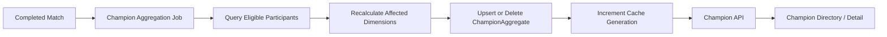

# Milestone 8 Design: Champion Aggregate Statistics and Analytics Pages

**Date:** 2026-08-05  
**Status:** Approved; implementation plan written  
**Implementation order:** Pipeline-first (locked)  
**Plan:** `docs/superpowers/plans/2026-08-05-milestone-8-champion-aggregates.md`

---

## 1. Goal

Implement champion-level aggregate statistics from successfully ingested matches, with honest collected-sample wording, exact-dimension storage, idempotent recalculation, public champion APIs, and Nuxt directory/detail pages.

Statistics represent **matches collected by League Helper** (primarily via searched players). They do **not** represent all League matches or a balanced global sample.

### Out of scope (deferred)

- Champion-versus-champion matchups / counters
- Patch-impact causality / patch-note ingestion
- AI coaching / player-specific champion coaching
- Global ladder crawling / full-population claims
- Authentication / payments
- Mainland Chinese servers

### Preserve

Riot player search; PostgreSQL; Redis/BullMQ; match-ingestion worker; Data Dragon resolution already implemented; mixed-queue match history; position normalization; player-profile redesign; existing public API contracts except explicit extensions below; existing migrations and stored matches; existing tests; Riot legal notice; no PUUID or secrets in public responses.

---

## 2. Locked decisions

| Topic                | Decision                                                                                                                                               |
| -------------------- | ------------------------------------------------------------------------------------------------------------------------------------------------------ |
| Implementation order | Pipeline-first: match-analytics → schema → rank-at-ingest → aggregation worker/CLIs → shared DTOs → API → Nuxt → rebuild → verify                      |
| Pure calculations    | `@league-helper/match-analytics` (no Prisma/Nest/BullMQ/Redis/env/apps)                                                                                |
| Rank                 | Known rank tier at ingestion from local `RankSnapshot` at cutoff; queues **420** and **440** only; others/`null` → UNKNOWN; never “rank at match time” |
| Default rollups      | Exact; ALL tier; ALL position; **no** ALL×ALL; **no** ALL platform/region/queue                                                                        |
| Directory ranking    | Require exact position before ranking request/table                                                                                                    |
| Platform             | Configured default `CHAMPION_STATS_DEFAULT_PLATFORM`; one exact platform; derive region from shared routing map                                        |
| Routes               | Canonical `/champions/:championKey`; numeric ID internal only; reject numeric page routes                                                              |
| Uniqueness           | Include `sourceNormalizationVersion` + `aggregationVersion`                                                                                            |
| Recalculation        | Full recalculation + upsert; delete zero-contributor keys; no blind increments; no contribution ledger                                                 |
| Enqueue              | After COMPLETED commit; reconcile repairs lost enqueues                                                                                                |
| Cache                | Generation-based invalidation; PostgreSQL authoritative                                                                                                |
| Reads/tests          | No live Riot; no live Data Dragon                                                                                                                      |
| Wording              | Collected-sample / League Helper’s sample; never global/true/worldwide win rate                                                                        |
| KDA                  | Match player UI: deaths>0 → (K+A)/D; deaths=0 → K+A; sampleSize=0 → null; deaths=0 & K+A=0 → 0                                                         |

---

## 3. Architecture

```text
packages/shared          provider-neutral contracts, public Zod DTOs, queue metadata, cache-key builders
packages/match-analytics pure formulas, sentinels, keys, rollups, accumulation, derivation
apps/worker              Prisma writes, BullMQ, rank assignment, rebuild/reconcile CLIs
apps/api                 read queries, Redis cache, DTO mapping, HTTP
apps/web                 /champions directory + detail (M7 design tokens)
```



---

## 4. Schema and persistence (§1)

### Current state

`ChampionAggregate` exists (future-ready) with GD10/GD15 totals/samples, `sourceNormalizationVersion`, empty-string platform/region sentinels, uniqueness **without** versions. Missing: CSD fields, `aggregationVersion`, `latestEligibleMatchAt`.

### Migration

**Name:** `champion_aggregate_csdiff_and_versioning`  
(tooling may prefix a timestamp)

**Add:**

- `totalCsDifferenceAt10` / `totalCsDifferenceAt15` (`Int?`)
- `csDifferenceAt10Samples` / `csDifferenceAt15Samples` (`Int` default 0)
- `aggregationVersion` (`String` default `"1"`)
- `latestEligibleMatchAt` (`DateTime?`)

**Unique:**

```text
@@unique([
  patch, platformRoute, regionalRoute, queueId, rankTier, teamPosition,
  championId, sourceNormalizationVersion, aggregationVersion
])
```

**CHECKs:** existing `wins <= sampleSize`; add non-negative checks for GD/CSD sample counters. Null↔sample invariants enforced in repository validation (and tests); total `0` with samples `> 0` is valid.

**`latestEligibleMatchAt`:** max eligible match end among contributors. Prefer `gameEndTimestamp`; else `gameCreation + gameDurationSeconds` only when duration `> 0` and result valid; else null. Never use ingestion time or `calculatedAt`.

**`teamPosition` column:** stores **normalized** position or ALL/UNKNOWN (not raw UTILITY/SOLO/DUO_*).

**Old rows:** preserved; `aggregationVersion="1"`; not treated as verified current until rebuild; API queries only configured versions; no auto-delete of older versions.

**Do not:** reset DB; delete matches; contribution ledger; store derived averages/CI/win rates; materialize ALL platform/region/queue or ALL×ALL by default.

**Sentinels (DB):** platform/region `""` reserved unused by default M8; queue `-1` reserved unused; tier/position `ALL` / `UNKNOWN` as strings.

---

## 5. `packages/match-analytics` (§2)

### Types

- `ExactChampionDimensions` — forbids ALL
- `MaterializedChampionDimensions` — allows approved ALL
- `expandChampionDimensionTuples(exact, policy) → MaterializedChampionDimensions[]`
- Default policy: exact + ALL tier + ALL position; combined ALL×ALL false; all platform/region/queue false
- Breaking materialization changes require `aggregationVersion` bump (no separate key field for rollup policy version)

### Dimension keys

Stable **JSON array tuple** with fixed field order (not object key-order dependent). Includes all unique storage dimensions + versions.

### Statistics

- Wilson score interval via inverse-normal z for any confidence ∈ `(0,1)` (tested at 0.90/0.95/0.99)
- Configurable sample confidence thresholds (default 30 / 100 / 500)
- Safe math: no NaN/Infinity
- Timeline nulls do not add zero samples
- No rounding in package; no `process.env`

### Public sentinel helpers

Package understands reserved ALL platform/region/queue. **M8 API/UI must reject those filters** so helpers cannot enable all-platform queries by accident.

### Error

`MatchAnalyticsValidationError` with safe machine-readable code; no secrets/payloads.

---

## 6. Worker and aggregation jobs (§3)

### Rank at ingestion

1. Normalize match; batch-link known `PlayerAccount`s by PUUID.
2. `rankAssignmentCutoffAt` = stable first persistence time (`Match.ingestedAt` / earliest `createdAt`, not retry `now`).
3. Batch-load snapshots with `capturedAt <= cutoff`.
4. 420 → `RANKED_SOLO_5x5`; 440 → `RANKED_FLEX_SR`; other queues → null.
5. Persist participants with `rankTierAtIngestion` in the ingestion transaction.
6. Never overwrite non-null with null; never create accounts for rank; no Riot.

### Ingestion → aggregation order

Validate/normalize → link → cutoff → snapshots → build participant inputs → persist Match/participants → COMPLETED → **commit** → enqueue aggregation → best-effort player cache invalidate.

Enqueue failure after commit: warn; reconcile repairs; do not roll back match.

### Job

- Queue: `champion-aggregation`
- Name: `RECALCULATE_CHAMPION_AGGREGATES`
- Payload: `{ matchId, sourceNormalizationVersion, aggregationVersion, correlationId? }`
- Deterministic job ID for concurrent dedupe; `removeOnComplete`/`removeOnFail` bounded retention so later recalculation can re-enqueue; rebuild does not depend on per-match job IDs
- Optional generation in job ID only if immediate re-enqueue while retained is required

### Recalculation

- Affected keys = union of previous stored state keys and current state keys (or document COMPLETED immutability + rebuild-only corrections)
- Batch reads by shared dims; bound key/participant batches; no permanent N+1
- Read outside long transactions; short write tx for upserts/deletes
- Zero contributors → **delete** that versioned key (no misleading zero-sample rows)
- Cache: increment generation scopes after commit (no `KEYS` scan)

### Dual workers

`main` starts only `match-ingestion` + `champion-aggregation` (no smoke queue). Graceful shutdown; failed init ⇒ unhealthy.

### Reconciliation freshness

Do not treat “some aggregate row exists” as match-current. Prefer match-level processing marker **if needed** after repo inspection:

Optional operational table (only if necessary): `matchId`, versions, status, `processedAt`, safe error code — no PUUID/raw payloads. Document before adding.

---

## 7. API and public contracts (§4)

### Endpoints

| Method | Path                                | Notes                                                  |
| ------ | ----------------------------------- | ------------------------------------------------------ |
| GET    | `/api/champions`                    | Static directory                                       |
| GET    | `/api/champions/:championKey`       | Static detail                                          |
| GET    | `/api/champions/:championKey/stats` | Exact stats + breakdown envelope                       |
| GET    | `/api/champion-stats`               | Ranking table; **position required**                   |
| GET    | `/api/champion-stats/filters`       | Defaults, available combinations, versions, disclaimer |

### Key behaviors

- Resolve `championKey` → `championId`; case-insensitive unique → 200 + `canonicalChampionKey` (Nuxt redirects path)
- Reject numeric keys as IDs in M8
- Platform omit → configured default; derive `regionalRoute`; reject ALL platform/region/queue
- Patch default: latest **semantic** patch with aggregates for platform (+ queue where practical); never lexicographic-only; never fall back to DDragon version
- Table: HTTP 200 + `rows: []` + `emptyReason` when no data
- Known champion, no aggregate: 200 + `stats: null` + emptyReason
- Unknown champion: 404 `CHAMPION_NOT_FOUND`
- `effectiveMinimumSample = max(explicitMin \|\| 0, includeInsufficient ? 0 : insufficientThreshold)`; filter in DB before sort/page
- Stable opaque cursor (sort value + championId tie-break + direction + versions + filter fingerprint) **or** offset for small M8 tables
- Disclaimer, `rankTierSemantics`, `sampleScope`, `freshness` at **response envelope** (not per row)
- Freshness: prefer `CURRENT` \| `RECALCULATION_PENDING` \| `UNKNOWN` from reconciliation/processing signals; **do not** use `latestEligibleMatchAt > calculatedAt`
- Separate `staticDataVersion` / `staticDataPatch` from `aggregatePatch`
- Concrete passive/spell/baseStats schemas or omit fields — never `z.unknown()` / raw DDragon JSON
- `positionBreakdown` in one stats response (five roles); client does not fire five requests
- Cache helpers in `packages/shared/src/champion-stats-cache.ts` (no Redis import); generation scope includes sourceNormalizationVersion, aggregationVersion, platform, patch, queueId
- Read generation → key → get; on miss query DB; re-read generation before write; skip/rebuild key if generation advanced

---

## 8. UI and routing (§5)

### Routes

- `/champions` — directory + filters + position-gated ranking
- `/champions/:championKey` — detail

### Public query params (canonical)

`platform`, `queue`, `tier`, `position`, `patch`, `search`, `tag`

Internal composable may use `queueId`; URLs always emit `queue`. Alias `queueId` → canonicalize to `queue`.

### Filters lifecycle

Parse → fetch filters meta → resolve defaults → single `replace` if needed → `filtersReady` → ranking only when `filtersReady && position`. No SSR hydration mismatch; no replace loops; no duplicate pre-canonical table fetch.

### View state

Retain previous table only with its `displayedResponse.sampleScope`; show Updating; ignore stale responses via request tokens; on failure keep old rows + warning.

### Directory vs stats

`search`/`tag` → directory only. Aggregate filters → stats only. Static directory uses active static-data version; aggregate patch separate.

### Detail

Independent states for metadata / exact stats / breakdown. Only `CHAMPION_NOT_FOUND` → not-found UI. Position selector updates URL in place. UNKNOWN tier not a primary selector option. Queues limited to `supportsStandardPositions`. Responsive table/cards; a11y radiogroup/tabs; `aria-live` for updates; no frontend CDN URL construction.

### Copy

Collected-sample disclaimer; search-driven limitation panel; platform/queue prominent; rank-at-ingestion warning when tier ≠ ALL; never “tier list” / global strength.

---

## 9. Tests, rebuild, operations, observability (§6)

### Baseline (before coding)

1. `pnpm format:check` (do **not** format first)
2. `pnpm lint`
3. `pnpm typecheck`
4. `pnpm test`
5. `pnpm test:api:integration`
6. `pnpm test:e2e`
7. `pnpm build`
8. Postgres/Redis healthy; mock ingest works

Record baseline vs post-M8 in a results table (FAIL vs SKIPPED distinct).

### E2E isolation

Isolated test Postgres/Redis; migrations; seed static champions; seed/ingest COMPLETED mocks; aggregate via test harness or setup-spawned rebuild with **test** config; bounded poll for completion; no developer DB; no racing local worker; no live Riot/DDragon; no public HTTP trigger for aggregation.

Test env vars: `TEST_DATABASE_URL`, `TEST_REDIS_URL`, `TEST_CHAMPION_STATS_DEFAULT_PLATFORM`, `TEST_MATCH_NORMALIZATION_VERSION`, `TEST_CHAMPION_AGGREGATION_VERSION`. Guards refuse non-test DBs; Redis test prefix/DB number.

### CLIs

| Command                          | Mutating | Notes                                                                                                                                                 |
| -------------------------------- | -------- | ----------------------------------------------------------------------------------------------------------------------------------------------------- |
| `aggregates:rebuild-champions`   | Yes      | `--dry-run`, filters, `--confirm`/env; `--json`; batch checkpointing; scoped deletes; optional ALL flags dry-run only or alternate aggregationVersion |
| `aggregates:reconcile-champions` | Enqueues | dry-run, filters, `--json`                                                                                                                            |
| `aggregates:status-champions`    | No       | exit nonzero only on command failure                                                                                                                  |
| `aggregates:audit-rank-coverage` | No       | ranked queues primary; non-ranked separate                                                                                                            |
| `aggregates:audit-champions`     | No       | integrity checks (wins≤n, counters, roles, no forbidden ALL rows, etc.)                                                                               |

Rebuild: per-batch short transactions; cache gen after commit; partial failure ≠ success; dry-run never writes/increments gen.

### Observability

Stable event names (`champion_aggregation_job_received`, `_completed`, `_failed`, `_keys_recalculated`, `_rows_upserted`, `_rows_deleted`, `_cache_generation_incremented`, `_reconcile_completed`, `_rebuild_batch_completed`, `champion_rank_assignment_completed`, …). Metrics backend deferred if none exists.

### Fixtures

Separate static seed, mock Riot fixtures, integration aggregates, Playwright scenarios. Small transparent sample sizes; include remake exclusion and stale-key deletion case.

### Security assertions

Schema + e2e scans: no puuid/PUUID, externalAccountId, rawPayload, API keys, DATABASE_URL, REDIS_URL, internal stacks, linkage IDs in public responses/Nuxt payloads/selected logs.

### Migration verification

Apply on existing dev DB with matches; clean test DB; no Match/Participant deletion; old aggregates get version `1`; new unique; rollback strategy documented (forward corrective if needed). No `prisma migrate reset`.

---

## 10. Environment variables

| Variable                                | Role                                |
| --------------------------------------- | ----------------------------------- |
| `CHAMPION_AGGREGATION_VERSION`          | Algorithm version (default `1`)     |
| `CHAMPION_AGGREGATION_MIN_SAMPLE`       | Default insufficient threshold (30) |
| `CHAMPION_AGGREGATION_CONFIDENCE_LEVEL` | Wilson level ∈ (0,1)                |
| `CHAMPION_AGGREGATION_BATCH_SIZE`       | Rebuild/job batching                |
| `CHAMPION_AGGREGATION_DEFAULT_QUEUE_ID` | UI/API default `420`                |
| `CHAMPION_STATS_DEFAULT_PLATFORM`       | Valid platform route                |
| `CHAMPION_STATS_CACHE_TTL_SECONDS`      | Response cache TTL                  |
| Source normalization version            | Aligned with match ingestion        |
| Rebuild/reconcile confirm env           | Mutation guards                     |

---

## 11. Acceptance criteria (summary)

1. Aggregates from eligible ingested matches; idempotent; retries do not double-count.
2. Remakes/incomplete/wrong versions excluded.
3. Dimensions distinct; sample size always present; Wilson CI; low-sample labels.
4. Missing timeline metrics null, not zero.
5. Collected-sample UI/API wording; directory + detail; URL filters; PG-only on filter change.
6. Redis degrade to PostgreSQL; API media URLs; no matchups/counters/patch/AI.
7. No PUUID/secrets; tests never live Riot/DDragon.
8. format:check, lint, typecheck, unit, integration, Playwright, build pass.

---

## 12. Recommended next milestone (after M8)

Do **not** auto-start. Candidates: matchup aggregates, improved ladder sampling for rank quality, or patch-comparison associations — chosen later.

---

## 13. Spec self-review

| Check                | Result                                                                                                                                                                                                                                                                                 |
| -------------------- | -------------------------------------------------------------------------------------------------------------------------------------------------------------------------------------------------------------------------------------------------------------------------------------- |
| Placeholders / TBD   | None remaining for locked M8 scope. Optional processing marker deferred to “if reconciliation needs it” with explicit gate.                                                                                                                                                            |
| Internal consistency | Exact/Materialized types; post-commit enqueue; freshness not from matchEnd>calculatedAt; URL `queue` vs API `queueId`; KDA matches player UI; cache generation shared.                                                                                                                 |
| Scope                | Single milestone; matchups/AI explicitly deferred.                                                                                                                                                                                                                                     |
| Ambiguity            | Processing-marker table only if reconcile cannot detect match-level completion — decide during worker implementation with documented choice. COMPLETED immutability vs previous∪current keys — prefer previous∪current when re-ingestion can rewrite dims; else document immutability. |

---

## 14. Implementation gate

Do **not** begin coding until:

1. This spec is reviewed and accepted by the product owner.
2. An implementation plan is written via the writing-plans skill.
3. Baseline pre-checks are recorded.

Pipeline-first execution order remains locked (§2 of this document).
