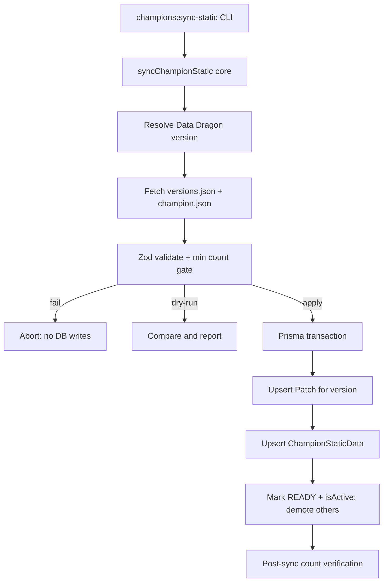

# Milestone 9 Task 1 Design: Champion Static Data Synchronization

**Date:** 2026-08-06  
**Status:** Approved  
**Plan:** `docs/superpowers/plans/2026-08-06-milestone-9-task-1-champion-static-sync.md`

---

## 1. Goal

Replace development-only `ChampionStaticData` seed coverage with a complete Data Dragon champion roster so `/champions` shows the full champion directory and detail pages use current metadata, without breaking existing `/champions/:championKey` routes.

### Out of scope (later Milestone 9 / later milestones)

- AI analysis
- Champion counters / matchup analysis
- Patch impact analysis
- Real match bootstrap / aggregate population
- UI redesign
- Prisma schema migrations
- Changes to `Match`, `MatchParticipant`, or `ChampionAggregate`

### Preserve

- Existing champion identity (`championKey` = Data Dragon string id)
- Existing URL builders and public champion API contracts
- Frontend isolation from Data Dragon (API-only)
- Seed patch row left intact (never overwritten in place)
- Historical matches referencing numeric `championId`

---

## 2. Locked decisions

| Topic | Decision |
| ----- | -------- |
| Patch strategy | Option A: one `Patch` per Data Dragon version; upsert by `Patch.version`; activate after success; demote previous active |
| Schema | No migration. Reuse `Patch` + `ChampionStaticData` |
| Identity | `championKey` = Data Dragon `id` string; `championId` = parsed Data Dragon numeric `key`. Do not infer IDs |
| URLs | Do not store icon/splash URLs; build at read time from `championKey` + `Patch.dataDragonVersion` |
| Persisted fields | Only fields with current consumers (plus required Prisma JSON columns filled with minimal valid placeholders) |
| Status writes | Create/update patch as `READY` only after full validation. Do not write intermediate `PENDING` during sync (enum already has `PENDING` for other/future use; sync does not need it) |
| Count gate | Reject payloads below minimum champion count before any activation |
| Deletes | Never delete champion rows (historical references) |
| Placement | `apps/api` only; thin CLI; reusable sync core |
| Network | Timeout + retry; mocked HTTP in tests; no live Data Dragon in CI |
| Secrets | None required for Data Dragon |

---

## 3. Architecture

```text
CLI (tsx)  →  sync core  →  fetch (timeout/retry)  →  Zod validate
                         →  map to rows
                         →  dry-run compare OR Prisma transaction
                         →  post-sync verification report
```



**Ownership**

| Unit | Responsibility |
| ---- | -------------- |
| `sync-champion-static.fetch.ts` | HTTP with timeout/retry; injectable `fetchFn` |
| `sync-champion-static.types.ts` | Sync Zod schemas (fuller than Redis enrichment types) |
| `sync-champion-static.mapper.ts` | Identity mapping, version normalization, URL helpers reuse |
| `sync-champion-static-core.ts` | Orchestration, dry-run, transaction, verification |
| `cli/sync-champion-static.ts` | Args, dotenv, exit codes, stdout/stderr only |

Do not couple sync writes to `DataDragonChampionService` Redis cache. Reuse its URL builders (or shared pure URL helpers) so icon/splash paths stay single-sourced.

---

## 4. Configuration

Add to root `.env.example` and `apps/api/.env.example`:

```env
DATA_DRAGON_VERSION=latest
DATA_DRAGON_SYNC_MIN_CHAMPIONS=100
DATA_DRAGON_SYNC_MAX_RETRIES=2
```

| Variable | Default | Notes |
| -------- | ------- | ----- |
| `DATA_DRAGON_VERSION` | `latest` | `latest` → first entry of `versions.json`; else pinned `X.Y.Z` |
| `DATA_DRAGON_SYNC_MIN_CHAMPIONS` | `100` | Reject smaller validated sets before DB apply/activate |
| `DATA_DRAGON_SYNC_MAX_RETRIES` | `2` | Retries after first attempt for transient failures |
| Existing | — | `DATA_DRAGON_LOCALE`, `DATA_DRAGON_REQUEST_TIMEOUT_MS`, fixed CDN base URL |

No API key. Frontend env unchanged.

---

## 5. Champion identity and field mapping

### Identity (canonical)

| App field | Data Dragon source | Rule |
| --------- | ------------------ | ---- |
| `championKey` | `entry.id` | Exact string (e.g. `DrMundo`, `MissFortune`). Never slugify display name |
| `championId` | `entry.key` | Parse decimal integer. Reject if not an integer string. Never invent IDs |
| `name` | `entry.name` | Display name (consumers call this champion name) |
| `title` | `entry.title` | Required |
| `tags` | `entry.tags` | String array; default `[]` if absent after validation requires array |

### Version / patch fields

| Concept | Storage |
| ------- | ------- |
| staticDataVersion | `Patch.dataDragonVersion` (= resolved CDN version) |
| staticDataPatch | `Patch.version` (same string as Data Dragon version for synced patches) |
| normalizedMajorMinor | Derived from version: first two numeric segments (e.g. `16.10.1` → `16.10`) |

### URLs (computed, not stored)

Reuse existing builders:

- Icon: `/cdn/{version}/img/champion/{championKey}.png`
- Splash: `/cdn/img/champion/splash/{championKey}_0.jpg`

### Required JSON columns without current API consumers

Prisma requires `baseStats`, `passive`, `spells`, `imageData`. Current public champion DTOs do not expose them.

Persist minimal valid values only:

| Column | Sync value |
| ------ | ---------- |
| `imageData` | Data Dragon `image` object when present; else `{}` |
| `baseStats` | Data Dragon `stats` object when present; else `{}` |
| `passive` | `{}` (`champion.json` does not include full passive) |
| `spells` | `[]` |
| `rawPayload` | leave `null` (no expansion) |

Do not add new columns. Do not fetch `championFull.json` in this task.

---

## 6. Synchronization flow

1. Load config (`DATA_DRAGON_VERSION`, locale, timeout, retries, min champions).
2. Resolve version:
   - If `latest`, GET `versions.json`, take index `0`.
   - Else use configured pin.
3. GET `cdn/{version}/data/{locale}/champion.json` with timeout + retry.
4. Zod-validate the complete file (version + `data` record of champions).
5. Map every entry; reject the whole sync if any entry fails identity rules.
6. Champion count gate: `mapped.length >= DATA_DRAGON_SYNC_MIN_CHAMPIONS`. If not, fail hard with a clear error (no writes).
7. **Dry-run** (`--dry-run`): load existing rows for that patch version (if any); classify new/changed/unchanged; print report; exit without writes.
8. **Apply** (single Prisma interactive transaction):
   1. Upsert `Patch` where `version = resolvedVersion` (create or update metadata; set `dataDragonVersion`, `normalizedMajorMinor`).
   2. Upsert each `ChampionStaticData` on `(patchId, championId)` updating key/name/title/tags/json fields.
   3. Set synced patch `staticDataStatus = READY`, `isActive = true`.
   4. Set all other currently active patches `isActive = false` (do not delete them; do not mutate their champion rows).
9. Post-sync verification (read after commit):
   - Count `ChampionStaticData` for active patch.
   - Count distinct `championKey` for active patch.
   - Fail the CLI (non-zero exit) if counts disagree or count is below minimum (should not happen if txn succeeded; defensive check).
10. Report results (human or JSON).

### Failure behavior

| Failure | DB effect |
| ------- | --------- |
| Network / timeout after retries | No writes; active patch unchanged |
| Invalid JSON / Zod failure | No writes |
| Count below minimum | No writes |
| Mapping identity error | No writes |
| Transaction error | Full rollback; active patch unchanged |

Partial updates are forbidden.

### Deprecated / removed champions

If a future Data Dragon version omits a champion that exists on that patch from a prior sync of the same version string, do **not** delete the row. Only upsert present champions. (Same version re-sync typically replaces content in place for present keys.)

---

## 7. CLI

```bash
pnpm champions:sync-static
pnpm champions:sync-static --dry-run
pnpm champions:sync-static --json
pnpm champions:sync-static --dry-run --json
```

- Registered on `@league-helper/api` and proxied from the monorepo root.
- Thin entry: parse args → call core → format output → exit code.
- `--json`: stdout is JSON only; operational logs on stderr.
- Dry-run must not write DB or flip active/version fields.

### Exit codes

| Code | Meaning |
| ---- | ------- |
| `0` | Success (including successful dry-run) |
| `1` | Failure (fetch, validation, count gate, txn, verification) |

### Report fields (human + JSON)

- resolved version
- champions discovered
- new / changed / unchanged (dry-run and apply)
- upserted count (apply)
- active patch id/version
- post-sync `championRowCount`
- post-sync `distinctChampionKeyCount`
- `ok: true|false` in JSON mode

---

## 8. Testing requirements

All Data Dragon HTTP mocked. No live CDN in tests.

| # | Case |
| - | ---- |
| 1 | Data Dragon response parsing |
| 2 | Champion key mapping (`id` → `championKey`) |
| 3 | Champion ID mapping (`key` → `championId`) |
| 4 | Icon URL generation |
| 5 | Splash URL generation |
| 6 | Static version storage on `Patch` |
| 7 | Updating existing champions |
| 8 | Inserting new champions |
| 9 | Dry-run performs no writes |
| 10 | Invalid provider response rejection |
| 11 | Timeout handling |
| 12 | Retry behavior |
| 13 | Transaction safety (failure leaves prior active patch) |
| 14 | No frontend Data Dragon dependency (existing web isolation test remains green) |
| 15 | Below-minimum champion count rejected before activation |
| 16 | Post-sync verification counts |

Prefer unit tests with injectable fetch + Prisma mock or test DB for persistence cases already used by API integration tests.

---

## 9. Verification (manual / local)

```bash
pnpm lint
pnpm typecheck
pnpm test
pnpm build
pnpm champions:sync-static --dry-run
pnpm champions:sync-static
```

SQL:

```sql
SELECT COUNT(*) FROM "ChampionStaticData";
-- Expect: well above seed size; typically 170+ on the active patch alone

SELECT p.version, p."dataDragonVersion", p."isActive", p."staticDataStatus", COUNT(c.id)
FROM "Patch" p
LEFT JOIN "ChampionStaticData" c ON c."patchId" = p.id
GROUP BY p.id
ORDER BY p."isActive" DESC, p.version DESC;
```

Also confirm:

- Existing routes `/champions/Ahri` etc. still work
- Icons and splash URLs load
- No duplicate `(patchId, championKey)` / `(patchId, championId)`
- Seed patch still exists and is inactive after sync

---

## 10. Remaining limitations (accepted)

- Match volume still too low for useful champion statistics (later task)
- Sync uses `champion.json` (summary), not full spell/passive text
- Worker aggregation unchanged
- Redis enrichment cache is independent; sync does not refresh Redis (optional follow-up, not required)
)
