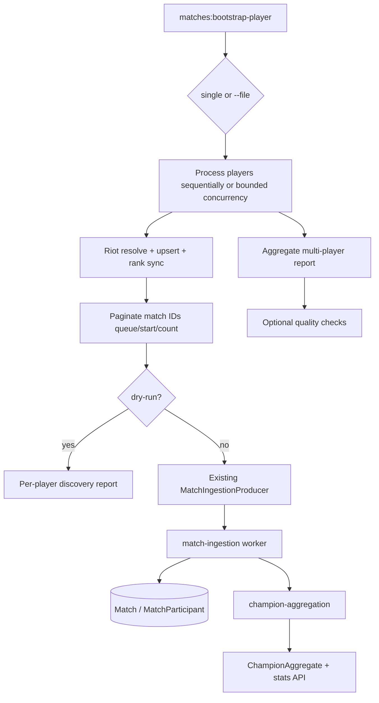

# Milestone 9 Task 2 Design: Real Match Data Bootstrap and Aggregate Validation

**Date:** 2026-08-06  
**Status:** Approved  
**Plan:** `docs/superpowers/plans/2026-08-06-milestone-9-task-2-match-bootstrap.md`  
**Depends on:** Milestone 9 Task 1 (`f2edef8` — static sync + Classic visibility filter)

---

## 1. Goal

Increase real match data volume through a controlled admin bootstrap path and verify the full pipeline:

```text
Riot API → player lookup → match discovery → match ingestion
  → MatchParticipant → champion aggregation → champion stats API → champion UI
```

This is **not** a production crawler. It is an operational tool for validating real data quality.

### Out of scope

- Tracked-player database tables
- Scheduled refresh / cron
- Ladder crawling / population discovery
- Automatic player selection
- Scraping / undocumented client APIs
- AI analysis
- Redesign of match ingestion or champion aggregation
- Mainland Chinese servers

### Preserve

- Existing search/refresh product flows
- Durable `IngestionJobRecord` + BullMQ match-ingestion idempotency
- Champion aggregation eligibility, dimensions, and min-sample read floor
- Public champion visibility filter (Classic `Jade_*` / ID ≥ 60000 hidden)
- No frontend Riot or Data Dragon calls

---

## 2. Locked decisions

| Topic | Decision |
| ----- | -------- |
| Mechanism | **A — admin CLI** `pnpm matches:bootstrap-player`; reuse existing resolve/upsert/discover/enqueue path |
| Not B | Do not stretch UI refresh (cooldown/locks/no pagination) for bulk bootstrap |
| Identity input | Single Riot ID is the **primary primitive** |
| Batch convenience | Optional `--file players.json` only; same pipeline per player; no tracked-player system |
| Default queue | Ranked Solo **`420`** for validation (directory default) |
| Normals | Still contribute to aggregates under their own `queueId` if ingested; not the bootstrap default |
| Max matches | Paginate with Riot `start`/`count` (page size ≤ 100); `--max-matches` with hard ops cap |
| Dry-run | May call Riot to discover match IDs; **must not** write DB rows, create durable jobs, or mutate ingestion state |
| Extraction | Minimal helpers only: resolve account, paginated match discovery, enqueue via existing producer — **do not** refactor product refresh |
| `--wait` | Lightweight summary of existing job completion only — **no** new monitoring system |
| `--file` concurrency | Sequential by default; optional bounded `--concurrency` |
| Aggregate smoke check | After bootstrap/rebuild: ≥1 `ChampionAggregate` with `queueId=420`, known position, `sampleSize > 0` (separate from UI floor 30) |
| Success criteria | Pipeline health **must** pass; `sampleSize ≥ 30` UI threshold is **best-effort** |

---

## 3. Architecture

```text
CLI (tsx, apps/api)
  → parse args (single ID XOR --file)
  → for each player (sequential or bounded concurrency):
       resolve Riot ID
       upsert account + sync ranks (reuse search path)
       paginate getRecentMatchIds(queue, start, count)
       dry-run: Riot discover OK; report would-enqueue; no DB/job writes
       apply: upsert + MatchIngestionProducer (existing idempotency)
  → optional --wait: summarize durable/BullMQ completion for enqueued IDs only
  → aggregate multi-player report + smoke aggregate check
```



**Reuse (do not fork):**

- Minimal shared helpers extracted from search path only where needed:
  - Riot account resolution
  - Paginated match ID discovery
  - Enqueue via existing `MatchIngestionProducer` / durable job path
- Do **not** refactor `PlayerRefreshService` or product refresh cooldown/locks
- Worker match-ingestion + post-complete aggregation enqueue (unchanged)
- Existing reconcile/status/audit CLIs for deep ops

**Do not add:** second ingestion pipeline; new public HTTP bootstrap endpoint; tracked-player models; new job monitoring system.

---

## 4. CLI contract

### Single-player mode (core)

```bash
pnpm matches:bootstrap-player \
  --game-name "PlayerOne" \
  --tag-line "NA1" \
  --platform na1 \
  [--queue 420] \
  [--max-matches 100] \
  [--dry-run] \
  [--json] \
  [--wait] \
  [--concurrency 1]
```

| Flag | Default | Notes |
| ---- | ------- | ----- |
| `--game-name` | required* | Riot game name |
| `--tag-line` | required* | Riot tag |
| `--platform` | required* | Platform route (e.g. `na1`) |
| `--queue` | `420` | Omit only if explicitly supported as “all queues” via a documented sentinel; default remains 420 |
| `--max-matches` | `100` | Cap after pagination; hard max e.g. `500` via config |
| `--dry-run` | false | May call Riot for discovery; no DB writes, no durable jobs, no ingestion mutations |
| `--json` | false | stdout JSON only; logs stderr |
| `--wait` | false | Lightweight: summarize completion of existing durable/BullMQ jobs for IDs touched this run (bounded timeout/polls). No new monitoring subsystem |
| `--file` | unset | See file mode |
| `--concurrency` | `1` | File mode only; sequential default; hard-capped (e.g. ≤3) |

\* Required unless `--file` is provided.

### File mode (ops convenience)

```bash
pnpm matches:bootstrap-player --file players.json [--queue 420] [--max-matches 100] [--dry-run] [--json] [--wait] [--concurrency 2]
```

Example `players.json`:

```json
[
  {
    "gameName": "PlayerOne",
    "tagLine": "NA1",
    "platform": "na1"
  },
  {
    "gameName": "PlayerTwo",
    "tagLine": "NA1",
    "platform": "na1"
  }
]
```

**File rules:**

- Zod-validate array of `{ gameName, tagLine, platform }`; reject invalid file before any Riot calls
- Optional per-player `queue` / `maxMatches` overrides **not required** for Task 2 (global flags apply)
- Process sequentially by default; `--concurrency` N with small bound
- **Reuse exact single-player pipeline** per entry
- One player failure must not abort reporting for others: continue, mark that player `ok: false`, overall exit `1` if any failed (or if zero players succeeded when ≥1 requested)
- Aggregate one rollup report (per-player results + totals)

### Exit codes

| Code | Meaning |
| ---- | ------- |
| `0` | All requested players succeeded (dry-run or apply) |
| `1` | Invalid args/file, or any player/pipeline failure |

---

## 5. Match volume and queues

| Topic | Rule |
| ----- | ---- |
| Page size | ≤ 100 per Riot `getRecentMatchIds` call |
| Pagination | Loop `start = 0, 100, …` until `max-matches` reached or page returns fewer than requested |
| Default queue | `420` |
| Normals | Eligible for aggregates if ingested under their queue; bootstrap default does not target them |
| Rank sync | Always sync ranks for bootstrapped accounts so 420/440 rank-at-ingestion can resolve when snapshots exist |
| Idempotency | Re-running bootstrap for the same IDs must not create duplicate matches or live duplicate jobs |

---

## 6. Data quality checks

Implemented as a verify step (CLI `--wait` completion path and/or `matches:bootstrap-verify` helper invoked from the same package — prefer **one CLI** with optional verify section to avoid tool sprawl).

| Check | Expectation |
| ----- | ----------- |
| Duplicate matches | No duplicate external match identities for ingested set |
| Missing participants | COMPLETED matches have expected participant count |
| Champion ID mapping | Participant `championId` maps to public static data when present in roster |
| Role normalization | Report position unknown/empty rate |
| Timeline | Report FETCHED / FAILED / SKIPPED rates |
| Remake exclusion | Remakes not counted as aggregation-eligible |
| Rank-at-ingestion | For 420/440 participants of bootstrapped players: coverage of non-null rank snapshot / UNKNOWN rate in resulting aggregates |

Hard fail verify only on integrity defects (duplicates, impossible participant counts). Coverage metrics are reported; low sample is not a hard fail by itself.

---

## 7. Aggregate validation success criteria

### Must pass (pipeline health)

1. Dry-run discovers IDs without writes  
2. Apply enqueues via existing producer; second run is idempotent  
3. Ingest reaches COMPLETED for the large majority of discovered IDs (document failures)  
4. Aggregation markers/jobs progress (reconcile if needed)  
5. Quality report has no critical integrity errors  
6. Public `/api/champions` still returns ~173 playable champions; Classic hidden  

### Aggregate smoke check (required after apply / rebuild)

Verify at least one `ChampionAggregate` row exists with:

- `queueId = 420`
- known (non-empty / non-sentinel) position
- `sampleSize > 0`

This is **independent** of the UI/API `minimumSample` floor (default 30). Smoke can pass while directory stats remain hidden.

### Best-effort (stats usefulness)

| Criterion | Target |
| --------- | ------ |
| Platform | Bootstrapped platform (e.g. `na1`) |
| Queue | `420` |
| Patch | Semantic patch of ingested matches |
| `sampleSize ≥ 30` | After multi-player `--file` session, aim for ≥1 public ranking key at floor; if unmet, report gap honestly — **pipeline still succeeds** if smoke check passes |
| UI | Directory/detail load; stats show when threshold met; collected-sample wording unchanged |

Do **not** hardcode “Ahri MID / Jinx BOT must exist” as a gate.

---

## 8. Configuration

Add to root + `apps/api` `.env.example` (no secrets):

```env
# Ops bootstrap (CLI only — not used by public UI)
MATCH_BOOTSTRAP_DEFAULT_QUEUE_ID=420
MATCH_BOOTSTRAP_DEFAULT_MAX_MATCHES=100
MATCH_BOOTSTRAP_HARD_MAX_MATCHES=500
MATCH_BOOTSTRAP_PAGE_SIZE=100
MATCH_BOOTSTRAP_FILE_MAX_PLAYERS=25
MATCH_BOOTSTRAP_MAX_CONCURRENCY=3
```

UI `PLAYER_*` defaults remain unchanged.

---

## 9. Files affected (expected)

```text
Create:
  apps/api/src/.../cli/bootstrap-player.ts          # thin entry
  apps/api/src/.../bootstrap/bootstrap-player-core.ts
  apps/api/src/.../bootstrap/bootstrap-player.args.ts
  apps/api/src/.../bootstrap/bootstrap-player.types.ts
  apps/api/src/.../bootstrap/bootstrap-verify.ts     # quality summary
  *.test.ts (mocked Riot / producer)

Modify:
  apps/api/package.json + root package.json         # matches:bootstrap-player
  apps/api/src/features/players/player-search.service.ts  # extract shared discover+enqueue if needed
  packages/server-riot or API Riot wrapper          # ensure start/queue available to CLI path
  .env.example, apps/api/.env.example
  README.md                                         # ops usage

Do not modify:
  Match / MatchParticipant / ChampionAggregate schemas (unless a bug is found)
  Worker aggregation formulas
  Classic visibility filter
  Frontend Data Dragon usage
```

Exact folder names may follow existing `integrations` / `features/players/cli` conventions during planning.

---

## 10. Testing strategy

| Layer | Coverage |
| ----- | -------- |
| Unit | Args: single vs file mutual exclusivity; file Zod; defaults queue 420 |
| Unit | Dry-run: Riot discover allowed; no producer/DB mutation calls |
| Unit | Pagination stops at max-matches / short page |
| Unit | File mode: one player fails, others still reported; exit 1 |
| Unit | Sequential default; concurrency bound respected |
| Unit | Aggregate smoke check (`queueId=420`, known position, `sampleSize > 0`) |
| Unit/integration | Mock Riot + mock producer: enqueue keys; second run skips completed |
| Manual | Real key + 2–3 player file; workers running; smoke check; UI spot-check |
| CI | No live Riot |

---

## 11. Risks

| Risk | Mitigation |
| ---- | ---------- |
| Rate limits | Sequential default; small concurrency; reuse Riot retries; page delay if needed |
| Rank UNKNOWN for other participants | Expected; bootstrap at least syncs the searched accounts |
| Still below sample 30 | Multi-player `--file`; honest best-effort criteria |
| Accidental all-queue flood | Default queue 420 |
| Divergent ingest path | Mandate producer reuse; code review gate |
| Large file abuse | `MATCH_BOOTSTRAP_FILE_MAX_PLAYERS` |

---

## 12. Implementation order

1. Extract/reuse discover+enqueue helper from player search (support `start` + queue)  
2. Single-player core + dry-run/json  
3. Apply path via existing producer  
4. File mode + failure isolation + rollup report  
5. Optional `--wait` + quality summary  
6. Tests, env examples, README  
7. Manual validation session; document aggregate sample outcomes  

---

## 13. Remaining limitations (accepted)

- Not a representative global sample of League  
- Rank-at-ingestion incomplete for players never searched  
- Directory stats may remain sparse until more players are bootstrapped  
- No automatic selection of “best” players for coverage  
)
