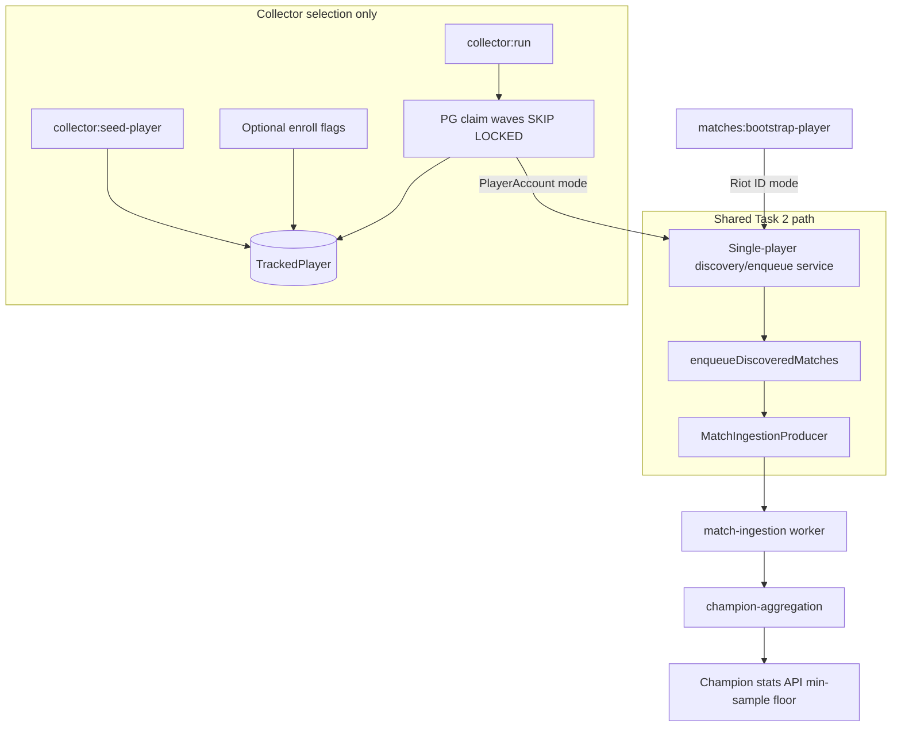
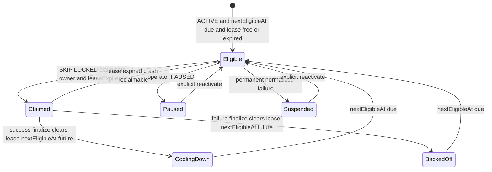
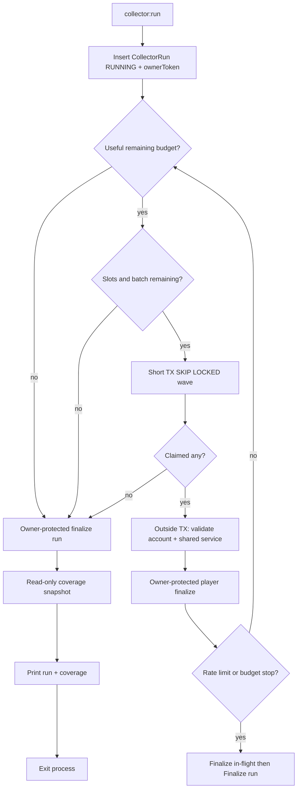

# Milestone 9 Task 3 Design: Population Collector Foundation

**Date:** 2026-08-06  
**Status:** Approved  
**Branch:** `milestone-9-task-3-population-collector`  
**Depends on:** Milestone 9 Task 2 (`3e44c09` — `matches:bootstrap-player` + shared discovery/enqueue helpers)  
**Plan:** `docs/superpowers/plans/2026-08-06-milestone-9-task-3-population-collector.md`

---

## 1. Goal and non-goals

### Goal

Design and later implement a **bounded population collector** that automatically selects known ranked players for refresh and feeds the existing Task 2 → match-ingestion → champion-aggregation pipeline, so **current-patch queue-420 collected samples** can grow toward the public ranking floor without lowering `CHAMPION_AGGREGATION_MIN_SAMPLE`.

Task 3 should:

- grow current-patch queue-420 samples toward the public ranking floor
- prove that a controlled collector run can increase eligible aggregate coverage

Reaching `sampleSize >=` configured minimum for at least one ranking key is an **end-to-end validation target** after a controlled seeded session — **not** a guaranteed outcome of every collector execution and **not** a merge gate for environments without enough Riot capacity.

### Explicit invariants

1. The collector changes **only** how known players are selected and scheduled for refresh.
2. All match discovery, durable job creation, ingestion, and aggregation continue through the existing Task 2 / Milestone 8 path.
3. Product search and refresh must remain successful even if optional collector enrollment fails.
4. Automatic enrollment sources remain **disabled by default** in Task 3.
5. Task 3 runs are **manually triggered and bounded**; no recurring execution exists yet.
6. Historical matches may still be ingested and stored; coverage reporting must distinguish current-patch queue-420 contribution.

### Non-goals (Task 3)

- Participant auto-enrollment / ladder crawling / unbounded player discovery
- BullMQ repeatable jobs, cron inside the API process, or in-process polling loops
- A second match-ingestion pipeline or direct `Match` / `MatchParticipant` writes from the collector
- Frontend Riot API calls, scraping, or undocumented Riot client APIs
- Redesign of `MatchIngestionProducer`, match-ingestion worker, champion aggregation formulas, `PlayerRefreshService`, Task 2 bootstrap CLI UX, or public champion visibility rules
- Redis locks for collector ownership
- `CollectorRunPlayer` / per-player run history tables
- Full monitoring dashboards
- OP.GG-scale collection
- Database partitioning or premature scale infrastructure
- AI-based player selection
- Mainland Chinese servers

### Preserve

- Task 2 CLI behavior and exit semantics
- Product search / refresh flows and Redis lock/cooldown behavior
- Durable `IngestionJobRecord` + BullMQ idempotency
- Champion aggregation eligibility, dimensions, and min-sample read floor
- Classic `Jade_*` / ID ≥ 60000 public visibility filter
- No frontend Riot or Data Dragon calls

---

## 2. Existing architecture to reuse

```text
Product / ops entry
  → shared single-player discovery/enqueue service (extracted from Task 2)
       resolve (Riot-ID mode) | load account (PlayerAccount mode)
       upsert/load PlayerAccount
       soft-fail rank sync
       paginateRecentMatchIds (queue configurable; default 420)
       enqueueDiscoveredMatches
         → MatchIngestionProducer / durable IngestionJobRecord
  → match-ingestion worker → Match / MatchParticipant
  → champion-aggregation worker → ChampionAggregate
  → champion stats API (configured min sample, generation cache)
```



### Reuse as-is

- `paginateRecentMatchIds`
- `enqueueDiscoveredMatches`
- `MatchIngestionProducer`
- Match-ingestion and champion-aggregation workers
- Champion read floor and cache generation invalidation
- Task 2 wait/smoke helpers (**CLI-only**, not in shared service)

### Extract minimally (Approach 2)

Nest-injectable single-player discovery/enqueue service owning only:

1. Resolve Riot ID when identity input requires it  
2. Upsert/load `PlayerAccount`  
3. Soft-fail rank synchronization  
4. Paginate recent match IDs  
5. Call existing `enqueueDiscoveredMatches`  
6. Return a **neutral application result**

**Entry modes:**

| Mode | Input | Used by |
| ---- | ----- | ------- |
| A. Riot ID | `gameName`, `tagLine`, `platform` | Task 2 CLI |
| B. Existing account | `playerAccountId` / loaded account | **Collector default** |

Collector normal path must **not** re-resolve Riot account identity on every run (no account-v1 cost for already known players). Re-resolve only if required identity fields are missing or an explicit repair path is invoked.

**Neutral result fields (no CLI coupling):**

- `playerAccountId`
- `discoveredMatchCount`
- `enqueuedCount`
- `skippedAlreadyCompleteCount`
- `externalMatchIds`
- `warnings`
- `normalizedFailureCode`
- `ok`
- `rateLimited` (+ optional `retryAfterMs`)

Do **not** include: output formatting, exit codes, JSON rendering, CLI flags, wait/smoke orchestration, lease metadata, collector counters.

### Do not reuse for collector ownership

- `PlayerRefreshService` Redis lock/cooldown (product UX)
- Spawning the Task 2 CLI process

### Transaction boundary (critical)

```text
claim tracked players in one short PostgreSQL transaction
→ commit claims
→ load/process each account outside the transaction
→ call shared discovery/enqueue service
→ update success/failure state with leaseOwner protection
```

The shared service must not know about `TrackedPlayer` leases, `CollectorRun` counters, priority, `nextEligibleAt`, collector backoff, or collector status transitions. It returns a neutral result; the collector translates that into scheduling state.

---

## 3. Proposed data model

### 3.1 `TrackedPlayer`

Canonical collection scheduling row. Identity via `PlayerAccount` FK — no duplicated Riot ID / PUUID fields.

| Field | Type / notes |
| ----- | ------------ |
| `id` | UUID PK |
| `playerAccountId` | FK → `PlayerAccount`, **unique** |
| `provider` | Scheduling snapshot (e.g. `RIOT`), copied at enrollment |
| `platformRoute` | Scheduling snapshot for allowlist/claim filter |
| `enrollmentSource` | First-enrollment provenance only |
| `status` | `ACTIVE` \| `PAUSED` \| `SUSPENDED` |
| `priority` | Int, default `0`; higher claimed first |
| `nextEligibleAt` | Non-null; default `now()` on enroll |
| `lastSuccessfulRefreshAt` | Nullable |
| `lastClaimedAt` | Nullable; set on claim for status/audit |
| `leaseOwner` | Nullable string (run owner token) |
| `leaseExpiresAt` | Nullable |
| `consecutiveFailureCount` | Int, default `0` |
| `lastFailureCode` | Nullable normalized code |
| `createdAt` / `updatedAt` | Standard |

**Enrollment source enum:** `ADMIN_SEED` \| `PRODUCT_SEARCH` \| `BOOTSTRAP`

`enrollmentSource` = source that **first** enrolled the account. Idempotent re-enrollment **must not overwrite** it. No multi-source history table in Task 3.

**Denormalized routing:**

- Copied from `PlayerAccount` at enrollment
- Enrollment/upsert repairs them if account routing data changes
- Collector processing validates agreement with canonical `PlayerAccount`
- Permanent silent divergence is not allowed
- Unique constraint remains **only** on `playerAccountId`

**FK policy:** `TrackedPlayer.playerAccountId` → `PlayerAccount` with `RESTRICT` / no-action (no orphan tracked rows on account delete).

**Defaults:**

- `status = ACTIVE`
- `priority = 0`
- `nextEligibleAt = now()`
- `consecutiveFailureCount = 0`
- lease / success / failure timestamps nullable

**Omit:** PUUID copies, Riot name/tag copies, graph-depth, champion-target fields, queue-specific schedule columns, per-run player history.

**Indexes:** implementation-validated against exact claim SQL (e.g. `(status, nextEligibleAt, priority, leaseExpiresAt)`). Exact order confirmed with `EXPLAIN` / `EXPLAIN ANALYZE` in the implementation plan. Raw `FOR UPDATE SKIP LOCKED` isolated in the tracked-player repository.

### 3.2 `CollectorRun`

One row per mutating `collector:run`. No `CollectorRunPlayer` in Task 3.

| Field | Purpose |
| ----- | ------- |
| `id` | UUID PK |
| `ownerToken` | Unique; equals tracked-player `leaseOwner` for the run |
| `status` | `RUNNING` \| `COMPLETED` \| `PARTIAL` \| `FAILED` |
| `startedAt` / `finishedAt` | Lifecycle |
| `platformFilter` | Optional CLI narrow of allowlist (null = no extra CLI filter) |
| `effectivePlatforms` | Persisted JSON string array: exact platform scope used for claim/eligibility this run (`allowlist ∩ platformFilter`) |
| `queueId` | Discovery queue for this run (default 420) |
| `batchLimit` / `concurrency` | Config snapshot |
| `playersClaimed` | … |
| `playersAttempted` | … |
| `playersSucceeded` | … |
| `playersFailed` | … |
| `ownershipLost` | Separate from `playersFailed` |
| `matchIdsDiscovered` | … |
| `matchesEnqueued` | … |
| `matchesSkippedComplete` | … |
| `rateLimitStops` | … |
| `budgetExhausted` | Bool, default `false` |
| `failureCode` | Run-level normalized code or null |
| `createdAt` / `updatedAt` | Standard |

**Do not persist:** API keys, PUUID lists, raw Riot payloads, stack traces, every external match ID, verbose per-player JSON blobs.

**Counter defaults:** all work counters `0`; `budgetExhausted = false`.

**Run status semantics:**

| Status | Meaning |
| ------ | ------- |
| `RUNNING` | Created but not finalized |
| `COMPLETED` | All attempted players completed collector workflow successfully; **or** zero eligible players |
| `PARTIAL` | Player failure(s), ownership lost, rate-limit/budget early stop, or intentional stop with remaining eligible work |
| `FAILED` | Setup/infra failure **before** meaningful processing |

**Meaningful processing:** at least one player claimed or attempted. After that, prefer `PARTIAL` over `FAILED` for later run-level problems.

**Stale run detection** (not lease duration):

```text
status = RUNNING
AND finishedAt IS NULL
AND startedAt < now() - COLLECTOR_STALE_RUN_AFTER_MS
```

`COLLECTOR_STALE_RUN_AFTER_MS` must exceed maximum expected run duration. No heartbeat daemon in Task 3.

### 3.3 Migration safety

- Add enums/models/indexes only
- Do **not** backfill every `PlayerAccount` into `TrackedPlayer`
- Zero tracked players by default after migrate
- Existing product behavior unchanged if collector commands never run
- Automatic enrollment flags remain `false`
- Implementation plan must document rollback considerations (even if Prisma rollback is operationally manual)

---

## 4. Player source policy

### Policy B (locked)

| Source | Task 3 default | Notes |
| ------ | -------------- | ----- |
| Explicit admin seed | **Enabled** | `collector:seed-player` single + optional `--file` |
| Successful Task 2 bootstrap | Behind `COLLECTOR_ENROLL_FROM_BOOTSTRAP=false` | Soft-fail; after non-dry-run account upsert |
| Successful product search | Behind `COLLECTOR_ENROLL_FROM_SEARCH=false` | Soft-fail; after resolve/upsert |
| Match participants | **Prohibited** | Task 4+ |

### Staged rollout

1. Admin seed only  
2. Enable bootstrap enrollment  
3. Enable successful-search enrollment  
4. (Task 4+) Bounded participant expansion with caps/quotas/depth limits  

### Admin seed rules

- Validate platform against collector allowlist before creating `TrackedPlayer`
- Fully Zod-validate seed file before any Riot calls; enforce max players
- Sequential by default; optional small bounded concurrency
- Isolate per-player failures; aggregate report; exit nonzero if any seed fails
- Idempotent: no duplicate rows; preserve `enrollmentSource`; repair denormalized routing
- Do **not** silently reactivate `PAUSED` / `SUSPENDED` without explicit `--reactivate`
- `PlayerAccount` may exist for unsupported platforms; those accounts must not become active collector targets

### Flag enrollment rules

**When a flag is `false` (default):**

- Perform **no** enrollment DB read/write for that source
- Perform **no** extra Riot request for enrollment
- Do not call enrollment helpers “and ignore the result” — short-circuit before the helper

**Bootstrap (`COLLECTOR_ENROLL_FROM_BOOTSTRAP=true`):**

- Enroll only after successful non-dry-run account resolve/upsert
- Do not wait for ingestion/smoke
- Do not enroll on dry-run
- Reuse already resolved `PlayerAccount` (no extra account-v1 call)
- Enrollment failure → warning only; bootstrap success unchanged

**Search (`COLLECTOR_ENROLL_FROM_SEARCH=true`):**

- Enroll only after successful resolve/upsert
- Do not delay/fail HTTP response on enrollment failure
- Do not enroll not-found/invalid searches
- No extra Riot call for enrollment
- Prefer inline soft secondary DB write; **no new enrollment queue** in Task 3

**Unsupported platform on flag enrollment:** skip + informational warning; not a product/bootstrap failure.

### Bootstrap CLI separation

`matches:bootstrap-player` remains a separate ops tool. It does **not** seed tracked players unless the bootstrap enrollment flag is enabled. Controlled initial population uses `collector:seed-player`.

---

## 5. Eligibility and priority rules

### Claimable when all are true

1. `status = ACTIVE`
2. `nextEligibleAt <= now()`
3. `leaseExpiresAt IS NULL OR leaseExpiresAt <= now()`
4. `platformRoute` ∈ effective platforms
5. `provider` supported (`RIOT` for Task 3)

Use **one database-derived timestamp per claim transaction** (`PostgreSQL now()` or injected test timestamp). Do not mix application clock and DB clock for eligibility predicates.

### Deterministic order

1. `priority DESC`
2. `nextEligibleAt ASC`
3. `lastSuccessfulRefreshAt ASC NULLS FIRST`
4. `id ASC`

### Effective platforms

```text
configured allowlist ∩ optional CLI platform filter
```

CLI platform outside allowlist → fail argument validation before creating a run. Allowlist never expands via CLI.

### Batch / concurrency semantics

- `batchLimit` = max tracked players **successfully claimed** this run (failed processing still counts)
- At any moment: claimed-but-not-terminal players for this run ≤ `concurrency`
- Wave / capacity-refill OK if that invariant holds and no player waits locally long enough to risk lease expiry
- Do not claim next work while claimed players remain unstarted locally beyond the concurrency model
- Queue ID is a **run input**, not a `TrackedPlayer` property (accepted: global `nextEligibleAt` delays the player for all queues)

### No-eligible result

- `CollectorRun.status = COMPLETED`
- Zero work counters
- Report next known eligibility time when practical
- Not `FAILED` or `PARTIAL`

### Success scheduling (status-aware)

On successful discovery/enqueue workflow (including zero recent matches when provider discovery OK), owner-protected finalization **always**:

- Clears `leaseOwner` / `leaseExpiresAt` for the current owner only
- Sets `lastSuccessfulRefreshAt = DB now()`
- Sets `nextEligibleAt = DB now() + minimumRefreshInterval` (still advances cadence even if paused/suspended, so reactivation does not immediately re-claim unless operator resets eligibility)
- **Never** sets `status = ACTIVE`

Then branch on **current** status at finalize time (concurrent operator changes included):

| Current status | Failure fields |
| -------------- | -------------- |
| `ACTIVE` | Reset `consecutiveFailureCount = 0` and clear `lastFailureCode` |
| `PAUSED` or `SUSPENDED` | **Preserve** `consecutiveFailureCount` and `lastFailureCode`; preserve operator status; clear only the owned lease and record success timestamps/cadence as above |

This keeps operator holds authoritative while still releasing the lease and recording that discovery/enqueue succeeded.

### Backoff (no jitter in Task 3)

```text
effectiveExponent = min(countBeforeIncrement, configuredMaxBackoffExponent)
delay = min(maxBackoff, baseBackoff * 2^effectiveExponent)

For RATE_LIMITED:
delay = min(maxBackoff, max(exponentialBackoff, normalizedRetryAfterMs))
```

Then atomically: increment failure count, set failure code, set `nextEligibleAt`, clear lease — under ownership protection.

Priority affects claim order only; it never bypasses eligibility, leases, allowlist, or budgets. Clamp admin/seed priority to `[COLLECTOR_PRIORITY_MIN, COLLECTOR_PRIORITY_MAX]` (default `0..1000`).

### Not eligibility factors in Task 3

Champion/role targeting, ladder rank, aggregate gaps, participant graph distance.

---

## 6. Claiming and lease semantics



### Claim model (PostgreSQL source of truth)

One short transaction:

1. Select eligible rows with PG `now()`, filters, deterministic order  
2. `LIMIT` wave size (`min(remainingBatchBudget, availableConcurrencySlots)`)  
3. `FOR UPDATE SKIP LOCKED`  
4. Set `leaseOwner`, `leaseExpiresAt`, `lastClaimedAt`  
5. Commit immediately  

**No network I/O inside the claim transaction.**

Expired leases are reclaimable even if `leaseOwner` is still populated; reclaim overwrites owner fields. Previous stale owner cannot finalize (`WHERE leaseOwner = currentOwnerToken`).

Prisma may use narrowly scoped `$queryRaw` / `$executeRaw` for claim; keep raw SQL:

- isolated in tracked-player repository
- parameterized
- covered by PostgreSQL integration tests
- documented with exact ordering and lease conditions

**Do not** emulate claiming by read-then-update in separate non-atomic calls.

**No Redis locks** for the same player in Task 3. No lease heartbeat / renewal in Task 3 — wave claiming is the chosen safety mechanism.

### Lease duration invariant

```text
COLLECTOR_LEASE_DURATION_MS
  > COLLECTOR_PLAYER_TIMEOUT_MS + safety margin
```

Config loading **rejects** unsafe combinations. Lease must exceed one bounded player operation (load/validate, rank soft-sync, paginated discovery, enqueue, provider retries). If an operation exceeds lease, finalization may legitimately lose ownership.

### Finalization

One atomic owner-protected update per player:

```sql
WHERE id = :trackedPlayerId
  AND leaseOwner = :ownerToken
```

Use DB `now()` for success/failure timestamps and scheduling. No read-modify-write of failure count outside the same locked update.

**Ownership lost (zero rows):**

- Do not alter `TrackedPlayer`
- Increment `CollectorRun.ownershipLost`
- Mark run `PARTIAL`
- Structured log with trackedPlayerId + owner token (no PUUID)
- Do **not** increment `playersFailed` / failure count / suspend

### Operator status transitions (`collector:set-player-status`)

Minimal operator command to make `PAUSED` / `SUSPENDED` / `ACTIVE` manageable:

```bash
pnpm collector:set-player-status \
  --tracked-player-id <uuid> \
  --status ACTIVE|PAUSED|SUSPENDED \
  [--force] \
  [--reset-failures]
```

Alternate identity selectors may resolve via `--player-account-id` or Riot ID + platform if already supported by seed helpers; prefer stable IDs for ops.

| Action | Behavior |
| ------ | -------- |
| `--status PAUSED` / `SUSPENDED` | Update status immediately; clear lease fields **only** with `--force`; otherwise in-flight owner may finish; success finalize must preserve operator status and failure context (see §5) |
| `--status ACTIVE` | Reactivate; set `nextEligibleAt` to now unless an explicit eligibility override is added later; clear failure fields only with `--reset-failures`; never steal a currently valid lease unless `--force` |
| `--force` | Clear `leaseOwner` / `leaseExpiresAt` as part of the status update |
| `--reset-failures` | Set `consecutiveFailureCount = 0` and `lastFailureCode = null` |

Success finalization under concurrent operator status changes follows the status-aware rules in §5.

### Audit distinctions

| Condition | Interpretation |
| --------- | -------------- |
| Expired lease on ACTIVE | Stale/recoverable |
| Valid lease with missing RUNNING owner | Suspicious / orphan |
| Lease owner mismatch on finalize | Ownership lost |
| PAUSED/SUSPENDED with active lease | Operator review; not necessarily corrupt |

---

## 7. Collector run lifecycle



### Start

1. Generate unique `ownerToken`  
2. Insert `CollectorRun(status=RUNNING)` with config snapshot  
3. Use same token for leases  

Dry-run does **not** use this mutating path (see §10).

### Waves and budgets

`PopulationCollectorService` owns the run budget and stop decision. Shared service returns normalized signals only.

Stop claiming new players when:

- `batchLimit` reached  
- match discovery budget reached  
- enqueue budget reached  
- provider rate-limit stop signal  
- no eligible players  
- no useful remaining discovery/enqueue capacity  

Before each wave, if no useful capacity remains, do not claim another player. Already claimed players finalize safely before exit.

Pass per-player:

```text
effectiveMaxMatches = min(
  configuredMatchesPerPlayer,
  remainingMatchIdBudget,
  remainingEnqueueBudget  -- conservative; prefer no overshoot
)
```

### Run finalization

```sql
WHERE id = :runId
  AND ownerToken = :currentOwnerToken
  AND status = 'RUNNING'
```

Zero rows → run-finalization conflict; exit nonzero; do not rewrite an already finalized run.

Unexpected exceptions: best-effort finalize as `FAILED` or `PARTIAL` (if any player attempted) without masking the original normalized failure code. Abrupt kill may leave `RUNNING` (later reported stale) — acceptable.

### Status mapping

| Situation | Status |
| --------- | ------ |
| Zero eligible | `COMPLETED` |
| All attempted succeed; batch/natural end | `COMPLETED` |
| Player failure / ownership lost / rate-limit / budget with remaining eligible work | `PARTIAL` |
| Setup failure before any attempt | `FAILED` |

Soft warnings (e.g. rank soft-fail) with all player workflows succeeding → still `COMPLETED`.

### Counter invariants (audit)

For **finalized** runs (`COMPLETED` / `PARTIAL` / `FAILED` after meaningful attempts):

```text
playersSucceeded + playersFailed + ownershipLost = playersAttempted
playersAttempted <= playersClaimed
matchesEnqueued <= matchIdsDiscovered
matchesSkippedComplete <= matchIdsDiscovered
finishedAt IS NOT NULL
```

Zero-eligible `COMPLETED` → all work counters zero (and the equality holds as `0+0+0=0`).

**Lease accounting before normal finalize:** a run must not finalize normally while it still owns unaccounted leases (`TrackedPlayer.leaseOwner = run.ownerToken` with non-null `leaseExpiresAt`). Before writing the final `CollectorRun` status:

1. Ensure every claimed player reached a terminal collector outcome (success, failure, or ownership-lost detection), **or**
2. Best-effort release/finalize remaining owned leases, **or**
3. Fail finalize with a normalized run code (e.g. `UNRELEASED_LEASES`) and exit nonzero

Audit must report leftover leases for a finalized owner token as findings.

Collector counters describe **discovery/enqueue orchestration only**, not ingestion/aggregation/ranking completion.

### Effective platform scope

At run start, compute and **persist** `CollectorRun.effectivePlatforms` as the concrete list used for claiming:

```text
effectivePlatforms = configuredAllowlist ∩ optionalCliPlatformFilter
```

Coverage, status, and audit must use this persisted scope (not re-derive from live env alone) so historical runs remain interpretable after allowlist changes.

### Task 4 compatibility

`PopulationCollectorService.runOnce(input)` accepts explicit inputs (ownerToken, platform filter, queueId, batchLimit, concurrency, budgets, timing/config). CLI loads config and passes values. Scheduler later calls the same service without emulating CLI argv.

---

## 8. Rate-limit and concurrency policy

### Principle

Budgets cover collector discovery **and** estimated downstream worker pressure. Do not ignore match/timeline fetches after enqueue.

### Authoritative hard limits

- Players claimed (`batchLimit`)
- Match IDs discovered (`maxMatchIdsPerRun`)
- Matches enqueued (`maxEnqueuePerRun`)

### Advisory estimate

```text
estimatedDownstreamRequests =
  matchesEnqueued × COLLECTOR_ESTIMATED_REQUESTS_PER_ENQUEUED_MATCH
```

Default factor `2` (match + timeline) is deliberately conservative. Not billing-grade. Do not change worker behavior to make the estimate exact.

### Suggested defaults (configurable; clamp to hard caps)

| Knob | Default | Hard bound |
| ---- | ------- | ---------- |
| `COLLECTOR_BATCH_SIZE` | 10 | max 50 |
| `COLLECTOR_CONCURRENCY` | 2 | max 5; player-level only |
| `COLLECTOR_MATCHES_PER_PLAYER` | 20 | max 100 |
| `COLLECTOR_MAX_MATCH_IDS_PER_RUN` | 200 | max 1000 |
| `COLLECTOR_MAX_ENQUEUE_PER_RUN` | 200 | max 1000 |
| `COLLECTOR_MIN_REFRESH_INTERVAL_MS` | 6h | min 1m |
| `COLLECTOR_BASE_BACKOFF_MS` | 15m | — |
| `COLLECTOR_MAX_BACKOFF_MS` | 24h | — |
| `COLLECTOR_MAX_BACKOFF_EXPONENT` | 8 | — |
| `COLLECTOR_PLAYER_TIMEOUT_MS` | 10m | must be < lease − margin |
| `COLLECTOR_LEASE_DURATION_MS` | 15m | must be > player timeout + 60s margin |
| `COLLECTOR_STALE_RUN_AFTER_MS` | 2h | must be > lease duration |
| `COLLECTOR_PLATFORM_ALLOWLIST` | `na1` | normalized set |
| `COLLECTOR_ESTIMATED_REQUESTS_PER_ENQUEUED_MATCH` | 2 | advisory only |
| `COLLECTOR_PRIORITY_MIN` / `MAX` | 0 / 1000 | clamp seed/admin priority |
| `COLLECTOR_ENROLL_FROM_BOOTSTRAP` | `false` | — |
| `COLLECTOR_ENROLL_FROM_SEARCH` | `false` | — |
| Near-floor diagnostic band | 20 through (minSample − 1) | reporting only |

Values live in `.env.example`; config loading clamps or rejects unsafe combinations (especially lease vs player timeout vs stale-run threshold).

### Budget stop → PARTIAL only when eligible work remains

| End condition | Status | `budgetExhausted` |
| ------------- | ------ | ----------------- |
| No eligible players | `COMPLETED` | false |
| Exact `batchLimit` after successes | `COMPLETED` | false |
| Match/enqueue budget hit with eligible remaining | `PARTIAL` | true |

### Rate-limit signal

Shared service returns normalized `rateLimited` / `RATE_LIMITED` / optional `retryAfterMs` (not only literal HTTP 429). Collector:

1. Finalizes that player with transient backoff (retry-after precedence)  
2. Increments `rateLimitStops`  
3. Stops new claims  
4. Finalizes run `PARTIAL`  
5. Does not suspend  

Reuse existing Riot client retries inside the shared path; exhausted retries still surface the same normalized signal.

### Concurrency scope

`COLLECTOR_CONCURRENCY` = max tracked players simultaneously inside shared discovery/enqueue. It does **not** control BullMQ match-worker or aggregation-worker concurrency (separate configs; still contribute to provider pressure).

### Queue-depth pressure

If waiting/active/delayed match-ingestion counts are already available cheaply, optional pre-wave ceiling may stop further claims. If not already available, **defer to Task 4** — do not build a new monitoring subsystem.

### Queue 420 boundary

Default and primary validation queue. Other queues only via explicit CLI/config. One `CollectorRun` does not mix queue counters. Coverage identifies the run’s queue.

---

## 9. Failure / backoff state machine

| Outcome | Player status | Failure count | Scheduling | Suspend? | Run impact |
| ------- | ------------- | ------------- | ---------- | -------- | ---------- |
| Success (incl. 0 matches) while `ACTIVE` | stay ACTIVE | Reset 0 | min refresh interval | no | success |
| Success (incl. 0 matches) while `PAUSED`/`SUSPENDED` | preserve operator status | **preserve** failure fields | clear owned lease; set success timestamp + nextEligibleAt | no | success |
| Transient (`RATE_LIMITED`, timeout, 5xx, network, `ENQUEUE_TRANSIENT`, `INTERNAL_TRANSIENT`, unknown) | ACTIVE | +1 | bounded backoff | **no** (unknown never suspends) | PARTIAL if any fail; rate-limit also stops claims |
| Permanent (`ACCOUNT_NOT_FOUND`, `UNSUPPORTED_PLATFORM`, `ACCOUNT_IDENTITY_INVALID`) | SUSPENDED | +1 | irrelevant while suspended | yes (conservative list only) | PARTIAL |
| Local integrity (`TRACKED_ACCOUNT_MISSING`, `ACCOUNT_REFERENCE_INVALID`) | ACTIVE (integrity issue, **not** provider `ACCOUNT_NOT_FOUND`) | +1 | backoff | **no** | PARTIAL |
| Rank sync soft-fail | unchanged | unchanged | unchanged | no | warning only; run may stay COMPLETED |
| Ownership lost | no write | no increment | unchanged | no | PARTIAL + `ownershipLost` |

**Do not suspend for:** config-related auth failures, unclassified 403/429, schema/parsing errors, DB failures, enqueue failures, unknown exceptions.

**Enqueue:** prefer `ENQUEUE_TRANSIENT`; report accurate partial enqueued count; no rollback of durable jobs; rely on idempotency on retry.

**ACCOUNT_NOT_FOUND (account mode):** only when provider definitively confirms canonical identity no longer resolvable/valid — not a missing local FK.

**Downstream:** worker/aggregate failures after enqueue do not rewrite historical `CollectorRun` status.

---

## 10. CLI / scheduling boundary

Task 3 ships **manual CLIs only**. No cron, BullMQ repeatables, or in-process loops.

| Command | Mutating? | Purpose |
| ------- | --------- | ------- |
| `pnpm collector:seed-player` | Yes (enrollment) | Single Riot ID or `--file` |
| `pnpm collector:set-player-status` | Yes (status/lease ops) | Set `ACTIVE` / `PAUSED` / `SUSPENDED` with optional `--force` / `--reset-failures` |
| `pnpm collector:run` | Yes (one bounded run) | Claim/process/finalize once and exit |
| `pnpm collector:status` | No | Operational snapshot |
| `pnpm collector:audit` | No | Invariant findings |

### Dry-run (locked)

Dry-run **skips claiming entirely**. Prefer `PopulationCollectorService.preview(input)` / `CollectorEligibilityService.preview(...)` sharing eligibility predicates and ordering **without** `FOR UPDATE` / updates.

Must **not**:

- insert `CollectorRun`
- mutate `TrackedPlayer` / leases / eligibility / failure counts
- create durable jobs or call `MatchIngestionProducer`
- call rank sync, account upsert, enrollment, cache invalidation, or any scheduling mutation

May:

- count eligible rows and return deterministic candidate IDs
- optionally load capped `PlayerAccount` sample (read-only)
- with `--sample-discovery N`: call a **strictly read-only** match-ID discovery path for the first N eligible players

**Read-only sample discovery path (required):**

- May call Riot `getRecentMatchIds` (paginated) using already-stored account routing fields
- Must **not** call: account resolve/upsert, rank sync, enrollment, `enqueueDiscoveredMatches`, `MatchIngestionProducer`, player-cache invalidation, lease/schedule updates, or the mutating shared discovery/enqueue service entrypoint
- Prefer a dedicated helper such as `paginateRecentMatchIds` invoked directly (or a `discoverOnly` mode that cannot enqueue)
- Report estimated discovered IDs / would-enqueue counts without performing enqueue classification writes

Defaults:

```bash
pnpm collector:run --dry-run
# eligibility preview only; no Riot calls

pnpm collector:run --dry-run --sample-discovery 2
# read-only Riot match-ID discovery for 2 candidates; no DB/job mutations
```

Preview is advisory (not a reservation). Do not implement dry-run as “claim then suppress finalize.”

### `collector:run` flags

`--platform`, `--queue`, `--batch-size`, `--concurrency`, `--max-matches`, `--max-match-ids`, `--max-enqueue`, `--json`, `--dry-run`, `--sample-discovery`

Safety-sensitive timing (lease, backoff, stale threshold) via env, not arbitrary CLI overrides, unless a clear ops need appears.

### Exit codes

| Command | 0 | 1 |
| ------- | - | - |
| Dry-run preview | Valid preview (incl. zero eligible) | Invalid args/config; or sample-discovery provider failure |
| Mutating run | `COMPLETED` | `PARTIAL` or `FAILED` |
| Seed / set-player-status | All requested ops succeeded | Invalid args/config or any requested op failed |
| Status | Report produced | Report cannot be produced |
| Audit | Checks pass | Findings exist or audit execution fails |

### Docs

README may show manual repeated invocation for testing but must state: one-shot execution, no self-scheduling, recurring = Task 4, no participant expansion.

---

## 11. Coverage and operational reporting

Coverage runs **after** CollectorRun finalization, read-only, with its own status: `available` \| `unavailable` \| `partial`.

Coverage failure → warning; does **not** rewrite run status/counters; does **not** force `collector:run` exit 1 when collector execution succeeded.

### Run summary (orchestration only)

players claimed/attempted/succeeded/failed, ownershipLost, matchIdsDiscovered, matchesEnqueued, matchesSkippedComplete, rateLimitStops, budgetExhausted, duration, platform/queue scope.

Do **not** label as ingested / aggregated / rankings updated / samples produced.

### Coverage snapshot scope

- Run platform scope (separate groups if multi-platform)
- Run `queueId`
- Latest semantic patch for that platform + queue
- `rankTier = ALL`
- Exact positions only: `TOP`, `JUNGLE`, `MIDDLE`, `BOTTOM`, `SUPPORT`
- Exclude ALL-position and UNKNOWN from exact-position ranking summaries
- Current normalization + aggregation versions
- Configured minimum-sample floor (not hardcode 30 in logic)
- Near-floor band: 20 through (configuredMinSample − 1)
- Max sampleSize by exact position
- Count of exact-position ALL-tier keys with `sampleSize > 0`
- Stored Match counts by `normalizedPatch` when cheap/indexed

**Canonical position note:** aggregates store normalized `SUPPORT`, not Riot `UTILITY`. Coverage must not report `UTILITY` as an aggregate position.

Prefer current DB snapshot over causal “this run added N samples” attribution unless before/after is captured reliably.

UNKNOWN rates only if a clear denominator exists; otherwise defer rather than mislead. Prefer `ChampionAggregate` + indexed Match scope counts over full participant scans.

### `collector:status` sections

Run state · Tracked population · Coverage · Warnings (stale runs, orphan leases, route mismatches, coverage unavailable).

---

## 12. API / UI impact

**None for public product APIs or Nuxt UI.**

- No new public HTTP collector endpoints  
- No Nuxt collector controls  
- No ranking request behavior changes  
- No reduction of minimum sample  
- No frontend polling for collector status  
- No public exposure of `TrackedPlayer` / `CollectorRun`  

Enrollment hooks are internal, soft-fail, flag-gated side effects using already resolved accounts.

---

## 13. Testing strategy

### 13.1 Pre-task ranking regressions (first implementation slice)

Focused tests only. Do not modify production ranking behavior unless a test exposes a real regression.

Lock:

1. sampleSize below configured floor → no ranking rows + `BELOW_MINIMUM_SAMPLE`  
2. sampleSize exactly at configured floor → row visible  
3. `rankTier = ALL` → reads materialized ALL-tier rows (does not sum tier-specific at read time)  
4. Exact position uses `TOP|JUNGLE|MIDDLE|BOTTOM|SUPPORT`  
5. Cache: empty responses generation/TTL bounded; after generation advances, newly eligible rows become visible  

Use configured minimum-sample in tests where practical. **Do not lower** `CHAMPION_AGGREGATION_MIN_SAMPLE`.

### 13.2 Shared extraction gate

Full existing Task 2 bootstrap suite remains green before collector orchestration proceeds. Verify Riot-ID path, dry-run no mutations, file mode, wait/smoke, shared idempotency helper, account-mode skips re-resolution. Prefer separate commit/checkpoint for extraction vs collector schema if review history benefits.

### 13.3 PostgreSQL integration (real transactions)

Required for:

- concurrent claims → disjoint rows  
- active leases skipped; expired reclaimed  
- stale owner cannot finalize  
- PAUSED during work survives success finalize  
- atomic failure count/backoff  
- deterministic claim ordering  

Unit tests cover orchestration; integration tests cover DB concurrency.

### 13.4 Collector orchestration / budget / dry-run / audit / coverage

As listed in approved clarifications: zero-eligible COMPLETED; PARTIAL cases; FAILED only pre-meaningful; finalization conflict; batchLimit across waves; in-flight ≤ concurrency; dry-run no mutations; budget no overshoot; coverage failure isolation; config validation (lease > timeout; stale-run > lease; etc.); enrollment soft-fail; no public routes.

### 13.5 E2E validation target (ops, not merge gate)

After controlled seeding + one or more manual runs with workers drained: at least one current-patch, queue-420, ALL-tier, exact-position key reaches configured public floor.

If unmet, report gap honestly (players processed, discovered/enqueued, current-patch yield, per-position max, remaining gap). Never lower the floor to pass validation.

**Merge gates:** correctness, lease safety, idempotency, bounded execution, status/audit, no regressions.

---

## 14. Rollout plan

1. Ranking regression tests (no behavior change unless bug found)  
2. Shared discovery/enqueue extraction + Task 2 suite green  
3. Prisma migration (`TrackedPlayer`, `CollectorRun`, indexes) — empty population  
4. Seed + set-player-status + preview + run + status/audit CLIs; enrollment flags off  
5. Controlled NA1 queue-420 admin seed + repeated manual `collector:run`  
6. Optional enable `COLLECTOR_ENROLL_FROM_BOOTSTRAP`  
7. Optional enable `COLLECTOR_ENROLL_FROM_SEARCH`  
8. Task 4: scheduler + expansion + deeper ops controls  

### Rollout stop conditions (Stage 2/3)

Stop increasing volume if: recurrent rate-limit stops, nonzero ownershipLost, accumulating stale leases, material worker backlog, aggregate audit fails, UNKNOWN rates regress unexpectedly, or public API / Task 2 regressions. Fix before enabling automatic enrollment flags.

---

## 15. Risks and accepted limitations

| Risk / limit | Acceptance |
| ------------ | ---------- |
| Global `nextEligibleAt` per player across queues | Accept for Task 3 |
| No participant expansion | Intentional |
| No causal run→sample attribution | Snapshot reporting only |
| Advisory downstream request estimate | Not exact |
| Stale RUNNING without daemon | Audit reports; no recovery worker |
| Lease expiry mid-player → ownership lost | Bounded; documented |
| Preview races with concurrent apply | Advisory only |
| OP.GG-scale / representativeness | Out of scope |
| Abrupt kill leaves RUNNING | Stale-run threshold |

---

## 16. Explicit Task 3 vs Task 4 boundary

| Task 3 (this) | Task 4+ |
| ------------- | ------- |
| Manual `collector:run` once | Coarse recurring scheduling |
| `runOnce` service ready for scheduler | Schedule overlap prevention |
| Admin seed + flag enrollment (off by default) | Gradual rollout controls |
| No participant enrollment | Bounded participant expansion + caps/quotas/depth |
| Wave claim, no heartbeat | Optional lease renewal if needed |
| No `CollectorRunPlayer` | Per-player history if justified |
| Optional queue-depth only if trivial | Queue-depth-aware throttling |
| Snapshot coverage CLI | Longer-term monitoring |
| Global refresh cadence | Adaptive / queue-specific schedules |

Task 3 ends with a safe, manually invoked `runOnce` that Task 4 can schedule **unchanged**.

---

## 17. File / schema changes expected

| Area | Expected changes |
| ---- | ---------------- |
| `apps/api/prisma/schema.prisma` | `TrackedPlayer`, `CollectorRun`, enums, indexes, relations |
| Prisma migration | Additive only; no PlayerAccount backfill |
| `apps/api/src/features/players/bootstrap/*` | Thin CLI over extracted Nest service; keep Task 2 behavior |
| New shared discovery service module | Riot-ID + PlayerAccount modes; neutral result |
| New collector feature module | config, repository (incl. raw claim SQL), eligibility preview, `PopulationCollectorService`, enrollment helper, coverage reporter, CLIs |
| Soft-fail hooks | Product search + bootstrap (behind flags) |
| `.env.example` (root + api) | Collector knobs + enrollment flags (defaults false) |
| `package.json` scripts | `collector:seed-player`, `collector:set-player-status`, `collector:run`, `collector:status`, `collector:audit` |
| Tests | Ranking regressions; Task 2 parity; PG claim/lease; orchestration; dry-run; coverage; config |
| README | Manual ops docs; one-shot warning; Task 4 boundary |
| Public HTTP / Nuxt | **None** |

Module/file layout may be adjusted in the implementation plan without changing the architecture boundaries above.

---

## 18. Recommended implementation sequence

1. **Ranking floor regressions** — lock BELOW_MINIMUM_SAMPLE / floor visibility / ALL-tier / cache generation behavior  
2. **Extract shared single-player discovery/enqueue service** — Riot-ID + account modes; Task 2 suite green; checkpoint  
3. **Prisma models + migration** — empty tracked population  
4. **TrackedPlayer repository** — claim SQL + owner-protected updates + integration tests  
5. **Enrollment + `collector:seed-player`** — admin only; `--file`; `--reactivate`  
6. **`collector:set-player-status`** — ACTIVE/PAUSED/SUSPENDED + `--force` / `--reset-failures`  
7. **Eligibility preview** — dry-run + read-only `--sample-discovery`  
8. **`PopulationCollectorService.runOnce`** — waves, budgets, rate-limit stop, counter equality, unreleased-lease guard, finalize  
9. **`collector:run` CLI** — mutating + dry-run + coverage warning section  
10. **`collector:status` / `collector:audit`**  
11. **Optional enrollment hooks** behind flags (default off; short-circuit when false)  
12. **Ops validation session** — seed, run, drain workers, report floor gap/success  

Do not implement Task 4 scheduling or participant expansion in this sequence.

---

## Success criteria summary

### Foundation correctness (required)

- Tracked players can be seeded idempotently  
- Eligible players claimed exactly once per run ownership  
- Concurrent runs do not process the same active lease  
- Collector uses existing discovery/enqueue path (account mode)  
- Reruns remain idempotent  
- Failures receive bounded backoff; permanent codes only from conservative list  
- Crashed leases recover by expiry  
- Collector status/audit is available  
- Search/bootstrap unchanged when enrollment fails or flags are off  
- Dry-run mutates nothing  

### Data-volume validation (ops target)

- Automated/manual collector increases current-patch queue-420 aggregates after controlled sessions  
- At least one exact-position ALL-tier ranking key reaches configured `sampleSize` floor after workers drain — report honestly if not  

---

## Appendix A — Locked decisions

| Topic | Decision |
| ----- | -------- |
| Player sources | Policy B; admin seed default; flags for search/bootstrap; no participants |
| Scheduling | Manual CLI only (option C); `runOnce` scheduler-ready |
| Claim/lease | PostgreSQL `FOR UPDATE SKIP LOCKED` (option A); wave claim |
| Audit persistence | `TrackedPlayer` + `CollectorRun` (option B); no `CollectorRunPlayer` |
| Shared path | Approach 2 extraction; collector uses PlayerAccount mode |
| Dry-run | Preview only; no claims; optional read-only `--sample-discovery N` |
| Operator status | `collector:set-player-status` with `--force` / `--reset-failures` |
| Counter equality | `succeeded + failed + ownershipLost = attempted` on finalized runs |
| Platform scope | Persist `CollectorRun.effectivePlatforms` |
| Public API/UI | None |
| Min sample | Unchanged |
)
