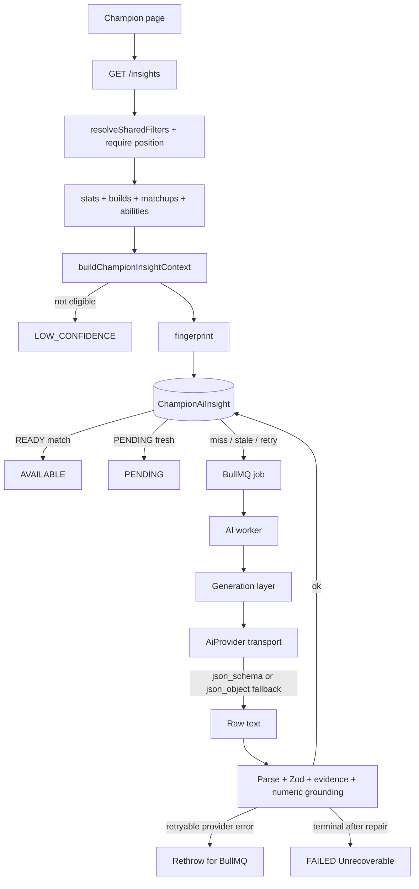

# Milestone 16 Design: Champion AI Insights

**Date:** 2026-08-13  
**Status:** Spec for review (approval conditions applied; not implemented)  
**Branch:** `milestone-16-ai-insights` (from `master` @ `834cb22`, M15 merged)  
**Plan:** `docs/superpowers/plans/2026-08-13-m16-ai-insights.md`

---

## 1. Goal

Add the first practical AI layer to League Helper: grounded, concise explanations of **existing** champion analytics using a **Qwen** model behind a vendor-neutral provider interface.

The LLM is an interpretation layer only. Deterministic League Helper analytics remain the source of truth.

### User-facing features (this milestone)

1. **Champion AI Summary** on Overview
2. **Build / rune / skill explanation** on Builds & Runes
3. **Matchup explanation** for a small number of Strong Against / Weak Against entries

### Success criteria

1. Champion pages work with `AI_ENABLED=false` and with Qwen down — no 5xx, no missing stats
2. AI never invents, recalculates, or overrides win rate, sample size, matchup rate, build rate, or other statistics
3. Generated claims reference evidence IDs that were supplied in the context; unknown IDs are rejected
4. Low-sample / ineligible slices cannot be presented as firm conclusions (preprocessing, not prompt-only)
5. Insights are cacheable by a deterministic fingerprint; page views do not call Qwen synchronously
6. Public API reuses champion filter semantics (`platform`, `patch`, `queueId`, `tier`, required `position`)
7. UI is supplemental: stats cards stay visible; sample sizes stay visible; no HTML from the model is rendered
8. AI prose is qualitative; the deterministic UI owns numeric display. Unsupported numeric prose is rejected
9. Partial eligibility is slice-specific: an eligible build may be explained while ineligible performance must not be treated as a firm conclusion
10. Provider transport failures are BullMQ-retryable; schema/grounding failures are terminal and must not be retried

---

## 2. Non-goals

- General-purpose League chatbot
- Raw-match AI analysis
- Player AI coaching / player-vs-baseline analysis (future; architecture must not block it)
- VOD analysis, autonomous agents, tier-list prediction, AI-generated statistics
- LangChain / vector DB / RAG / web browsing / fine-tuning / training
- OpenAI hosted API dependency
- Tight coupling to Ollama, vLLM, Alibaba Cloud, or any one serving runtime
- Reusing `PlayerAnalysisReport` / `AnalysisFinding` for champion insights
- Precomputing every `champion × platform × patch × rank × position × queue` combination
- Exposing internal prompts, API keys, evidence IDs, or DB identifiers in the public UI
- Mainland Chinese servers / undocumented League Client endpoints

---

## 3. Current repository reality

### 3.1 Deterministic foundation (already shipped)

| Capability | Contract / location |
|---|---|
| Champion stats | `GET /api/champions/:championKey/stats` — `ChampionStatsQuerySchema` / `ChampionStatsResponseSchema` |
| Builds / runes / spells / skills | `GET /api/champions/:championKey/builds` — `ChampionBuildsQuerySchema` (position **required**) |
| Matchups | `GET /api/champions/:championKey/matchups` — `ChampionMatchupsQuerySchema` (position required; optional `rankScope`) |
| Abilities | Embedded on `ChampionDetail.abilities` via `extractChampionAbilities` — no standalone endpoint |
| Filters | `resolveSharedFilters` in `apps/api/src/features/champions/champion-stats-filters.ts` |
| Rank mapping | `legacyTierFilterToRankScope` / `serializeRankScopeCacheToken` |
| Sample confidence | `INSUFFICIENT \| LOW \| MEDIUM \| HIGH` on champion metrics |
| Build sample bands | `BELOW_DISPLAY (<5) \| EXPLORATORY (5–9) \| CREDIBLE (10–19) \| STRONG (≥20)` |
| Matchup display floor | `CHAMPION_MATCHUP_DISPLAY_FLOOR` (default 10); `lowSample` on rows |
| UNKNOWN rank | Hidden (`UNKNOWN_RANK_HIDDEN`) on builds/matchups |
| Cache | Redis generation keys for stats/builds/matchups; PostgreSQL is authoritative |
| Workers | BullMQ: match-ingestion, champion-aggregation, participant-rank-enrichment |

There is **no** AI package, **no** `AI_*` env, and **no** champion insight model. `PlayerAnalysisReport.aiSummary` is a future player-coaching slot and must not be reused here.

### 3.2 Frontend

One detail route: `apps/web/pages/champions/[championKey].vue`. Overview / Builds & Runes / Matchups are **client-side tabs**, not nested routes. Tab is not URL-synced. Filters are URL-authoritative: `platform`, `queue` (mapped to API `queueId`), `tier`, `position`, `patch`.

### 3.3 Preserve

Existing champion APIs, filter parsers, sample-size wording, ranking floor of 30, matchup Wilson ranking, build eligibility, Redis generation cache, worker topology, Riot-key isolation, collected-sample disclaimer.

---

## 4. Locked decisions

| Topic | Decision |
|---|---|
| Source of truth | Deterministic APIs/aggregates only. AI explains; it does not compute. |
| Package | New `@league-helper/ai` (like `@league-helper/match-analytics`): no Prisma, no Nest, no Vue. HTTP only inside the provider adapter. |
| Public DTOs / jobs | Stay in `@league-helper/shared` |
| Persistence | Dedicated `ChampionAiInsight` table. Do **not** use `PlayerAnalysisReport`. |
| Serving | OpenAI-compatible HTTP (`/v1/chat/completions`). Default local host: Ollama at `http://localhost:11434/v1`. Swap later to vLLM/SGLang by changing `AI_BASE_URL` + `AI_MODEL`. |
| Structured output | Prefer `response_format.json_schema` (JSON Schema constrained). If the server rejects that mode, the **provider** falls back to `json_object` for the same request. Parsing/Zod still happen in the generation layer. |
| Model | `qwen2.5:7b` is the **M16 evaluation / development default**, not a permanent product lock. Operators change `AI_MODEL`; fingerprint includes the model so generations invalidate. Document `qwen2.5:14b` as an optional local upgrade. Avoid Qwen3 thinking-mode as a default (JSON pollution). |
| Transport vs model | `AI_PROVIDER=openai_compatible` is the adapter. The Qwen identity is `AI_MODEL`. Do not encode Ollama-only APIs outside the provider. |
| Provider vs generation | `AiProvider` is transport-only (HTTP, timeout, auth, structured-output mode + fallback, raw text). JSON parse, Zod, evidence, numeric grounding, and validation repair live in the generation layer. |
| Generation trigger | **Lazy on-demand.** `GET` builds context, fingerprints, returns existing READY row or enqueues BullMQ and returns `PENDING`. Never call Qwen on the request thread. |
| Who builds context | **API** (reuses `ChampionStatsService` / `ChampionBuildsService` / `ChampionMatchupsService` / abilities on detail). Persist `inputContext` JSON on the PENDING row. Worker is a thin generate + validate + persist step. |
| Redis for insights | **Not in this milestone.** Postgres is durable; insight QPS is per-champion. Stats/builds/matchups Redis cache stays unchanged. |
| Query contract | Same as builds: `ChampionBuildsQuerySchema` (required `position`). UI `tier` only — do not add matchups-only `rankScope` until the page uses it. |
| HTTP for insights | **200 + status enum** for disabled/pending/unavailable/low-confidence. **404** unknown champion. **400** invalid filters / missing position. Never 5xx because Qwen failed. |
| Evidence IDs | Internal + stored; stripped from public DTO. Server rejects unknown IDs. Each evidence id carries `interpretationAllowed`. Statistical ids may be cited only when allowed. |
| Numbers in prose | Qualitative only. Deterministic UI owns win rates, sample sizes, pick rates, KDA, CS, DPM, gold/CS diffs. Validator rejects unsupported numeric prose (not merely unmatched percentages). Ability-supplied numbers and the matching patch string may appear. |
| Precompute | None. No crawler of all filter combinations. |
| Frameworks | No LangChain. Native `fetch` + Zod. |
| Enabled default | `AI_ENABLED=false`. App and tests must pass without a model process. |
| Partial eligibility | `generationEligible` is true if **any** slice is interpretation-allowed. Performance, builds, and matchups are independently flagged. Eligible build insight must not unlock ineligible performance conclusions. |
| Failure classes | **Retryable** (timeout, 429, 5xx, network): rethrow for BullMQ. **Terminal** (parse/Zod/evidence/grounding after bounded repair): persist FAILED and `UnrecoverableError` so BullMQ does not retry a deterministic bad generation. |

---

## 5. Architecture

```text
Riot / ingestion
      ↓
deterministic analytics (ChampionAggregate, ChampionBuildAggregate, MatchupAggregate, abilities)
      ↓
existing champion read APIs (stats / builds / matchups / detail)
      ↓
AI context builder (@league-helper/ai)  →  evidence catalog + generationEligible
      ↓
fingerprint (sha256 of canonical context + promptVersion + model + provider)
      ↓
PostgreSQL ChampionAiInsight lookup
      ↓
  READY + same fingerprint → return AVAILABLE
  else enqueue BullMQ GENERATE_CHAMPION_AI_INSIGHT (deduped by fingerprint job id)
      ↓
worker: load inputContext → generation layer (prompt + provider + parse/Zod/evidence/numeric grounding)
      ↓
persist READY, or FAILED terminal, or rethrow retryable provider error
      ↓
GET /api/champions/:championKey/insights
      ↓
champion page (Overview / Builds / Matchups) — supplemental copy only
```



Layering (matches M8):

| Package / app | Responsibility |
|---|---|
| `@league-helper/shared` | Public Zod DTOs, job payload, queue names, prompt version constant |
| `@league-helper/ai` | Transport `AiProvider`; generation layer (prompts, parse, Zod, evidence, numeric grounding, repair); context builder; fingerprint; eval fixtures/CLI |
| `@league-helper/api` | Config, GET endpoint, context assembly from existing services, enqueue, persistence |
| `@league-helper/worker` | BullMQ consumer: generate from stored context, persist result |
| `@league-helper/web` | Supplemental AI sections on existing tabs |

`@league-helper/match-analytics` stays pure deterministic math. Do not put LLM code there.

---

## 6. Provider abstraction (transport only)

```ts
interface AiProvider {
  readonly id: string; // e.g. 'openai_compatible'
  generate(request: AiGenerationRequest): Promise<AiGenerationRawResult>;
}

type AiGenerationRequest = {
  system: string;
  user: string;
  /** JSON Schema for constrained decoding. Always supplied by the generation layer. */
  jsonSchema: Record<string, unknown>;
  jsonSchemaName: string;
  temperature: number;
  maxOutputTokens: number;
  timeoutMs: number;
};

type AiGenerationRawResult = {
  content: string;
  structuredOutputMode: 'json_schema' | 'json_object';
};

class AiProviderError extends Error {
  readonly retryable: boolean;
  readonly statusCode?: number;
}
```

The provider **must not**: parse JSON, accept a Zod schema, check evidence, ground numbers, or run validation repair.

The provider **must**:

1. POST `${baseUrl}/chat/completions` with `messages`, `model`, `temperature`, `max_tokens`.
2. Prefer constrained decoding:
   `response_format: { type: 'json_schema', json_schema: { name, strict: true, schema } }`.
3. If the server responds that `json_schema` is unsupported (HTTP 400/422 with a mode/schema error, or an equivalent body), **retry that same request once** with `response_format: { type: 'json_object' }` and report `structuredOutputMode: 'json_object'`.
4. Timeout via `AbortSignal`. `Authorization: Bearer ${AI_API_KEY}` only when the key is non-empty.
5. Map failures:
   - timeout / network / connection refused / HTTP 429 / HTTP 5xx → `AiProviderError { retryable: true }`
   - HTTP 401/403 / unsupported model that will not succeed on retry → `AiProviderError { retryable: false }`
6. Return **raw** `choices[0].message.content` string. Do not validate it.

Temperature default **0.2**. No OpenAI SDK. Do not call `api.openai.com` unless an operator points `AI_BASE_URL` there.

JSON Schema is authored next to the Zod stored-insight schema (hand-maintained companion exported from shared or `@league-helper/ai`). Zod remains the validation source of truth; JSON Schema is a decoding constraint.

### Generation layer (not the provider)

`generateChampionInsight` in `@league-helper/ai`:

1. Build system/user prompts + JSON Schema from the stored-insight Zod companion
2. `provider.generate(...)`
3. Parse JSON (strip a single ```json fence if present)
4. Zod validate
5. Evidence + slice `interpretationAllowed` rules
6. Numeric grounding
7. HTML reject
8. On validation failure: **one** repair call (`AI_MAX_REPAIR_ATTEMPTS`, default 1) with the validator error in the user turn; re-run steps 3–7
9. Still invalid → throw `AiOutputValidationError` (`retryable: false`)
10. Provider retryable errors **propagate unchanged** (do not convert them into validation failures)

Disabled: `AI_ENABLED=false` short-circuits in the API before enqueue. The worker may boot idle.

---

## 7. Configuration

Follow existing `loadXConfig()` + `ValidationFailureError` + `.env.example` placeholders (no secrets).

| Variable | Default | Notes |
|---|---|---|
| `AI_ENABLED` | `false` | Hard off switch |
| `AI_PROVIDER` | `openai_compatible` | Adapter id |
| `AI_BASE_URL` | `http://localhost:11434/v1` | OpenAI-compatible root |
| `AI_MODEL` | `qwen2.5:7b` | M16 eval/dev default only; not a permanent lock |
| `AI_API_KEY` | empty | Optional; never `NUXT_PUBLIC_*` |
| `AI_TIMEOUT_MS` | `60000` | |
| `AI_MAX_OUTPUT_TOKENS` | `1200` | |
| `AI_TEMPERATURE` | `0.2` | |
| `AI_MAX_REPAIR_ATTEMPTS` | `1` | |
| `CHAMPION_AI_INSIGHT_QUEUE_NAME` | `champion-ai-insight` | |
| `CHAMPION_AI_INSIGHT_WORKER_CONCURRENCY` | `1` | Bound local GPU |
| `CHAMPION_AI_INSIGHT_JOB_ATTEMPTS` | `3` | BullMQ attempts |
| `CHAMPION_AI_INSIGHT_STALE_PENDING_MS` | `120000` | Re-enqueue crashed PENDING |
| `CHAMPION_AI_INSIGHT_FAILED_RETRY_MS` | `60000` | Cooldown before GET re-enqueues FAILED |

Prompt version is a **code constant** (`champion-insight-v1`), not an env knob, so fingerprint invalidation is intentional and reviewable.

Local startup (documented in README + `.env.example`):

```bash
ollama pull qwen2.5:7b
ollama serve
# AI_ENABLED=true AI_BASE_URL=http://localhost:11434/v1 AI_MODEL=qwen2.5:7b
```

`qwen2.5:7b` is the baseline used for M16 live eval and local docs. Changing `AI_MODEL` is supported and expected; do not hardcode this tag outside config defaults, eval docs, and `.env.example`.

League Helper must boot and serve champion pages with AI off and with Ollama absent.

---

## 8. AI context builder

Do **not** pass Prisma entities or raw matches to the model.

Input: already-bounded public analytics DTOs (`ChampionStatsResponse`, `ChampionBuildsResponse`, `ChampionMatchupsResponse`, `ChampionDetail.abilities`).

Output: `ChampionInsightContext` plus an evidence catalog.

### Included (only fields League Helper already calculates)

- Champion: `championId`, `championKey`, `name`, `position` (required ranking position)
- Scope: `patch`, `platform`, `queueId`, `tier`, collected-sample kind
- Performance: `sampleSize`, `wins`, `winRate`, `sampleConfidence`, Wilson bounds if present, KDA / CS/min / DPM / vision / GD@10/@15 / CSD@10/@15 when non-null
- Builds: at most top **2** core, top **1** starting / boots / runes / spells / skill order — names + sampleSize + pickRate + winRate (only if exposed) + `sampleBand` + `interpretationAllowed`
- Matchups: at most top **3** strong + top **3** weak already returned by the matchup API (already display-floor filtered). Include opponent key/name, sampleSize, wins/losses, winRate, `lowSample`, `sampleConfidence`, GD/CSD@10 when present, `interpretationAllowed`
- Abilities: subject champion all slots (name + normalized description + optional cooldown/cost/range). Opponent abilities only for the selected matchup candidates (name + truncated description). **No icon URLs.**
- Confidence flags: overall `generationEligible`, per-slice and per-evidence `interpretationAllowed`, plus `performanceConclusionsAllowed` / `buildInsightAllowed` / `matchupExplanationsAllowed`

### Excluded

- Raw match payloads, PUUIDs, internal DB ids (insight row id is not sent to the model)
- Icon / splash URLs
- Collector / scheduler / budget internals
- Rank-hidden UNKNOWN slices (short-circuit before builder)
- Build rows with `BELOW_DISPLAY` (omit entirely)
- Invented metrics (pick rate / ban rate at champion level, unofficial MMR)

### Low-sample and partial eligibility (required)

Eligibility is **slice-specific**. One eligible slice does not make other slices eligible.

| Input | Context handling |
|---|---|
| Champion `sampleConfidence === 'INSUFFICIENT'` | Include metrics for honesty; `performance.interpretationAllowed = false`; `performanceConclusionsAllowed = false`; `CHAMPION_WIN_RATE` / sample / Wilson / KDA / CS / DPM ids are **not** citable as statistical conclusions |
| Build `EXPLORATORY` or `lowSample` | Include as exploratory; that row `interpretationAllowed = false` |
| Build `BELOW_DISPLAY` | Omit |
| Build `CREDIBLE` or `STRONG` | `interpretationAllowed = true`; `buildInsightAllowed = true` |
| Matchup `lowSample === true` | Include for honesty; `interpretationAllowed = false`; **do not** request a matchup explanation |
| Matchup not low-sample | `interpretationAllowed = true`; may appear in `matchupInsights` |
| Any interpretation-allowed build, matchup, or performance slice | `generationEligible = true` |
| No interpretation-allowed slice at all | `generationEligible = false` → API status `LOW_CONFIDENCE`, **no enqueue** |
| UNKNOWN tier | Never build; `UNAVAILABLE` + `UNKNOWN_RANK_HIDDEN` |

**Partial eligibility example (required test):** champion performance INSUFFICIENT, one CREDIBLE core build, no eligible matchups:

- `generationEligible === true`
- `buildInsightAllowed === true`
- `performanceConclusionsAllowed === false`
- `matchupExplanationsAllowed === false`
- Valid: `buildInsight` citing `BUILD_CORE_PRIMARY`; summary that discusses the setup and limited sample using `BUILD_CORE_PRIMARY` + `CONFIDENCE_WARNING` / `SCOPE_*`
- Invalid: summary or strengths that cite `CHAMPION_WIN_RATE` (or other performance statistical ids) as a conclusion

`generationEligible` and per-evidence `interpretationAllowed` are deterministic in `@league-helper/ai`, not prompt suggestions.

### Evidence IDs

Stable strings generated from the context. Each catalog entry is `{ id, interpretationAllowed }`.

```text
SCOPE_PATCH                         # always citable (identity)
SCOPE_POSITION                      # always citable
SCOPE_RANK                          # always citable
CONFIDENCE_WARNING                  # always citable (qualifies limited evidence)
CHAMPION_WIN_RATE                   # only if performance.interpretationAllowed
CHAMPION_SAMPLE_SIZE                # only if performance.interpretationAllowed
CHAMPION_SAMPLE_CONFIDENCE          # only if performance.interpretationAllowed
CHAMPION_WILSON_INTERVAL            # only if performance.interpretationAllowed
BUILD_CORE_PRIMARY                  # only if that row is allowed
BUILD_CORE_SECONDARY
BUILD_STARTING_PRIMARY
BUILD_BOOTS_PRIMARY
RUNE_PAGE_PRIMARY
SPELL_PAIR_PRIMARY
SKILL_ORDER_PRIMARY
MATCHUP_STRONG_<championKey>        # only if that matchup is allowed
MATCHUP_WEAK_<championKey>
ABILITY_<championKey>_<PASSIVE|Q|W|E|R>  # always citable for mechanics; never sole evidence for a statistical claim
```

Validation:

- Unknown id → reject
- Statistical id with `interpretationAllowed: false` → reject
- Statistical claim (summary/strengths/weaknesses/buildInsight/matchupInsights that assert better/worse/winning) must cite **at least one** allowed statistical evidence id from the relevant slice
- Ability ids cannot be the only evidence for a matchup/build/performance conclusion
- `SCOPE_*` and `CONFIDENCE_WARNING` never unlock a statistical conclusion by themselves

---

## 9. Structured output

Internal (stored, validated) schema — conceptual:

```ts
type GroundedClaim = {
  text: string;          // bounded length, plain text, no HTML
  evidence: string[];    // min 1, all must be in catalog
};

type ChampionAiInsightPayload = {
  summary: GroundedClaim;                 // 2–4 sentences, ~80–600 chars
  strengths: GroundedClaim[];             // max 3
  weaknesses: GroundedClaim[];            // max 3
  buildInsight: GroundedClaim | null;
  matchupInsights: Array<{
    opponentChampionKey: string;          // must exist in context matchups
    side: 'STRONG' | 'WEAK';
    text: string;
    evidence: string[];
  }>;                                     // max 6; only interpretationAllowed matchups
};
```

`generatedAt`, `provider`, `model`, `promptVersion`, `fingerprint` are **server-stamped**, never taken from the model.

Validation pipeline (generation layer only):

1. Parse JSON (reject markdown fences by stripping once, then parse; still reject if not JSON)
2. Zod schema (required fields, bounds, enums)
3. Every evidence id ∈ catalog
4. Statistical evidence ids must have `interpretationAllowed: true`
5. Every `opponentChampionKey` ∈ supplied matchups, side matches, and that matchup is interpretation-allowed
6. `buildInsight` null unless `buildInsightAllowed`; `matchupInsights` empty unless allowed opponents exist
7. **Numeric grounding (qualitative prose):** extract numeric tokens from all text fields (percentages, digit groups, decimals). Reject any number that is not on the **allowlist**. Allowlist is **not** the analytics stats. It is:
   - numbers that appear verbatim in supplied ability `name` / `description` / `cooldown` / `cost` / `range`
   - the scope `patch` string (identity, also shown in page chrome)
   - Reject even *correct* restatements of win rate, pick rate, sample size, KDA, CS/min, DPM, gold/CS diffs, Wilson bounds. The deterministic UI owns those.
8. Reject HTML tags / script-like content in text fields

Word-form quantities (“two cores”, “slightly above even”) are allowed. Digit sample sizes (“120 games”, “n=8”) are not.

On validation failure: one generation-layer repair attempt, then **terminal** `AiOutputValidationError`.

Public DTO **strips evidence arrays**. UI never needs them in M16.

---

## 10. Prompts

Module: `packages/ai/src/prompts/champion-insight-v1.ts`  
Constant: `CHAMPION_AI_PROMPT_VERSION = 'champion-insight-v1'` (participates in fingerprint).

Rules the system prompt must state:

- You explain League Helper collected-sample statistics. You are not a source of stats.
- Never invent or recalculate win rate, pick rate, ban rate, sample size, KDA, CS, DPM, matchup rate, rune rate, build rate, or any other statistic.
- **Do not restate statistics as numbers.** Prose must be qualitative (e.g. “slightly above even”, “limited sample”). The application UI displays the exact figures.
- Never claim one option is statistically better unless supplied evidence with `interpretationAllowed: true` supports it.
- If a slice has `interpretationAllowed: false`, do not draw a firm conclusion from it. You may note that evidence is limited using `CONFIDENCE_WARNING`.
- Partial eligibility: you may explain an allowed build while refusing unsupported performance conclusions from the same context.
- Distinguish observed association from causation.
- Ability text may explain **plausible mechanical** reasons for an **already-established** statistical matchup. Never invert that: abilities must not invent a counter.
- Do not introduce game facts absent from context except the supplied ability text.
- Return only JSON matching the supplied schema. No lore. No live-game coaching.

User payload: canonical JSON of `ChampionInsightContext` (no icon URLs, bounded).

---

## 11. Fingerprint and lifecycle

```text
fingerprint = sha256(
  canonicalJson(context) + '\0' + promptVersion + '\0' + model + '\0' + provider
)
```

Canonical JSON: sorted keys, no `undefined`, stable number formatting. Context must not include timestamps that change without analytics changing (`calculatedAt` / `latestEligibleMatchAt` **excluded** from the hashed context, or hashed only as the analytics values themselves — lock: **omit volatile timestamps from hashed context**; they can appear in stored input for debug).

### GET behavior

1. `AI_ENABLED=false` → `DISABLED`, `insight: null`
2. Invalid champion → 404 `CHAMPION_NOT_FOUND` (same as other champion routes)
3. Missing/invalid filters → 400
4. UNKNOWN tier → `UNAVAILABLE`, `emptyReason: UNKNOWN_RANK_HIDDEN`
5. Build context; if `!generationEligible` → `LOW_CONFIDENCE` (do not enqueue)
6. Lookup unique `(championId, patch, platformRoute, queueId, rankTier, teamPosition, contextFingerprint)`
7. `READY` → `AVAILABLE` + public insight
8. `PENDING` and `updatedAt` within stale window → `PENDING`
9. `FAILED` within retry cooldown → `UNAVAILABLE` (do not tight-loop)
10. Otherwise upsert `PENDING` with `inputContext`, enqueue job, return `PENDING`
11. Enqueue failure → persist `FAILED` with `QUEUE_UNAVAILABLE`, return `UNAVAILABLE` **200** (champion page must not die)

BullMQ job id: `ai_champ_{fingerprint[:24]}` (≤128 chars), LIVE-state dedupe like match-ingestion.

Worker:

- If row already READY, no-op.
- On success write `structuredResult` + `generatedAt` + `READY`.
- **Terminal** (`AiOutputValidationError`, non-retryable `AiProviderError` such as 401): `markFailed` with a short code (`VALIDATION`, `GROUNDING`, `PROVIDER_AUTH`, …), then throw BullMQ `UnrecoverableError` so attempts are not spent re-running the same bad output. Persist FAILED **before** throwing so the row is not stuck PENDING.
- **Retryable** (`AiProviderError.retryable === true`): do **not** mark FAILED; rethrow so BullMQ retries. Row stays PENDING. On final attempt exhaustion, the worker `failed` handler marks FAILED with `PROVIDER_RETRY_EXHAUSTED` (no prompt dump, no API key).
- Truncate `failureReason` to ~500 chars.

Do not regenerate on every request. Analytics change → context change → new fingerprint → new row. Prompt/model change → new fingerprint.

---

## 12. Prisma

New enum + model. Do not add columns to `PlayerAnalysisReport`.

```prisma
enum ChampionAiInsightStatus {
  PENDING
  READY
  FAILED
}

model ChampionAiInsight {
  id                 String                  @id @default(uuid())
  championId         Int
  championKey        String
  patch              String
  platformRoute      String
  queueId            Int
  rankTier           String                  // public filter: ALL | exact tier
  teamPosition       String                  // ranking position
  contextFingerprint String
  promptVersion      String
  provider           String
  model              String
  status             ChampionAiInsightStatus @default(PENDING)
  inputContext       Json
  structuredResult   Json?
  failureReason      String?
  generatedAt        DateTime?               @db.Timestamptz(3)
  createdAt          DateTime                @default(now()) @db.Timestamptz(3)
  updatedAt          DateTime                @updatedAt @db.Timestamptz(3)

  @@unique([championId, patch, platformRoute, queueId, rankTier, teamPosition, contextFingerprint], map: "ChampionAiInsight_scope_fp_key")
  @@index([championId, patch, status])
  @@index([status, updatedAt])
}
```

TRUNCATE allowlists in API/worker integration tests must include `ChampionAiInsight`.

---

## 13. Public API

```text
GET /api/champions/:championKey/insights
```

Declare **before** `GET :championKey` (same as `/builds`, `/matchups`, `/stats`).

Query: `ChampionBuildsQuerySchema` — `platform`, `patch`, `queueId`, `tier`, required `position`, optional `minimumSample` / `includeInsufficient` (accepted for parser compatibility; they affect the underlying stats read the same way as other champion endpoints).

Response (conceptual):

```ts
{
  disclaimer: CHAMPION_STATS_DISCLAIMER,
  aiDisclaimer: 'AI explanations are generated from League Helper statistical data and champion ability information.',
  sampleScope: SampleScope,
  resolvedFilters: ChampionStatsResolvedFilters,
  status: 'DISABLED' | 'PENDING' | 'AVAILABLE' | 'UNAVAILABLE' | 'LOW_CONFIDENCE',
  emptyReason?: 'UNKNOWN_RANK_HIDDEN' | 'INSUFFICIENT_EVIDENCE' | 'GENERATION_FAILED' | 'QUEUE_UNAVAILABLE' | 'AI_DISABLED',
  insight: {
    summary: string,
    strengths: string[],
    weaknesses: string[],
    buildInsight: string | null,
    matchupInsights: Array<{
      opponentChampionKey: string,
      side: 'STRONG' | 'WEAK',
      text: string,
    }>,
    generatedAt: string, // ISO
  } | null
}
```

Never expose: prompts, `inputContext`, evidence IDs, API keys, provider URLs, `failureReason` internals beyond a safe emptyReason.

---

## 14. Frontend

Preserve tab structure. AI is supplemental muted copy, not a fourth tab, not a replacement for stat cards.

| Surface | Placement | Content |
|---|---|---|
| Overview | After `ChampionSampleOverview` / performance cards, before position breakdown | “AI Insight” + summary + optional 1–2 strength/weakness lines + disclaimer |
| Builds & Runes | Inside `ChampionBuildsPanel` after intro / low-sample banner, before item sections | “AI explanation” + `buildInsight` |
| Matchups | On Strong/Weak rows that have a matching `matchupInsights` entry | Short “Why?” line under stats; stats remain primary |

States (reuse muted `role="status"` / `PlayerErrorBanner` patterns — **no skeletons**):

| API status | UI |
|---|---|
| no position | Do not fetch; omit section or “Select a position…” |
| `DISABLED` | Omit section (AI off is not an error) |
| `PENDING` | “Generating AI insight…” + light poll (2s, 4s, cap ~15s, then leave pending text) |
| `AVAILABLE` | Render text (plain text interpolation only) |
| `LOW_CONFIDENCE` | “Not enough collected-sample evidence for an AI explanation.” |
| `UNAVAILABLE` | “AI insight unavailable.” |
| fetch error | Omit / unavailable — **must not** fail the champion page |

Disclaimer once per insight panel (not on every matchup row):

> AI explanations are generated from League Helper’s statistical data and champion ability information.

Do not use the phrase “AI coaching” (e2e currently forbids it as a deferred-feature leak).

---

## 15. Security and bounds

- Model output is untrusted: Zod + evidence + slice eligibility + numeric grounding + no HTML rendering (`text` interpolation only)
- Bound context size (top-N lists, truncated ability descriptions, e.g. 400 chars/slot)
- Bound output tokens, timeout, repair count, worker concurrency (default 1), matchup explanations (max 6)
- Do not log Riot IDs, PUUIDs, `AI_API_KEY`, or full prompts at info level
- `AI_API_KEY` backend/worker only
- Job payload: `insightId` (uuid) + `contextFingerprint` + optional `correlationId` — not the full context (context is already in Postgres)

---

## 16. Testing

| Area | Coverage |
|---|---|
| Context builder | Includes real analytics fields; omits URLs/raw matches; BELOW_DISPLAY omitted; low-sample `interpretationAllowed=false`; evidence ids stable; `generationEligible` false on empty/weak slices |
| Partial eligibility | Performance INSUFFICIENT + one CREDIBLE build → `generationEligible` true, `buildInsightAllowed` true, `performanceConclusionsAllowed` false; performance statistical ids not citable; build id citable |
| Output validation | Malformed JSON; unknown evidence; missing fields; overlong text; unknown opponent key; side mismatch; citing disallowed performance ids |
| Numeric grounding | Reject `54.8%` when context is 51.2%; reject **correct** `51.2%` restatement; reject `120 games` / `KDA 3.2` / `8.4 CS/min`; accept qualitative “slightly above even”; accept an ability cooldown that appears verbatim in supplied ability text |
| Fingerprint | Same context → same hash; analytics change → new hash; prompt version change → new hash; model change → new hash; volatile timestamps omitted |
| Provider | Tries `json_schema` first; falls back to `json_object` on unsupported; does not parse/Zod; timeout/5xx are retryable; 401 is not |
| Generation vs provider | Fake provider returns raw string; generation layer validates; repair happens in generation, not provider |
| Worker | READY short-circuit; validation → FAILED + UnrecoverableError (no extra BullMQ attempts); retryable timeout is rethrown and does not mark FAILED until attempts exhausted |
| API | disabled / pending / available / unavailable / low-confidence / 404 champion / 400 missing position / filter propagation (`queueId` vs UI `queue`) |
| Frontend | Panel states; disclaimer; stats still visible; no HTML injection; composable does not break page when insights 200-unavailable |
| Eval | Fixture file sanity in CI (`pnpm ai:eval`); live Qwen opt-in (`pnpm ai:eval -- --live`) with summary metrics |

Do not require a live model in CI.

---

## 17. Evaluation harness

`packages/ai/src/eval/` — 12–16 JSON fixtures, including:

1. High-sample clear matchup
2. Close matchup (~50%, similar Wilson)
3. Low-sample matchup (`interpretationAllowed: false`)
4. Strong build signal (STRONG band, clear pick/win gap)
5. Two statistically similar cores
6. Different rank scopes (ALL vs GOLD) as two fixtures
7. Insufficient data (`generationEligible: false`)
8. Matchup with useful ability interaction (Ahri Charm vs dash/unstoppable-style opponent text)
9. Mechanical intuition conflicts with statistics (abilities sound like a counter; stats say otherwise — model must follow stats)
10. INSUFFICIENT champion sample but one CREDIBLE build (**partial eligibility** — build insight allowed, performance conclusions not)
11. UNKNOWN-rank-equivalent: empty/hidden (API-level; fixture marks ineligible)
12. Exploratory-only builds (no firm buildInsight expected)

`pnpm ai:eval` (root): offline — load fixtures, build context, assert eligibility/evidence catalogs including the partial-eligibility fixture.

`pnpm ai:eval -- --live`: call the **configured** `AI_MODEL` (docs default `qwen2.5:7b` as the M16 eval baseline, not a lock). Print each fixture’s output and validation errors. **No LLM-as-judge.**

Live-eval **summary metrics** (required; print a table at the end):

| Metric | Meaning |
|---|---|
| fixtures | Total live fixtures attempted |
| skipped_ineligible | `generationEligible === false` (correct skip) |
| generated | Provider returned content |
| json_schema_mode / json_object_mode | Structured-output mode actually used |
| validation_pass / validation_fail | Generation-layer accept/reject |
| repair_used | Repair attempt invoked |
| terminal_validation_fail | Failed parse/Zod/evidence/grounding after repair |
| retryable_provider_fail | Timeout/5xx/network (fixture marked error, not a validation fail) |
| numeric_grounding_fail | Subset of validation_fail caused by numeric prose |
| evidence_fail | Subset caused by evidence/eligibility rules |
| p50_ms / p95_ms | Latency of successful provider calls |
| model | `AI_MODEL` used for this run |

Exit non-zero on live validation_fail or retryable_provider_fail. Exit 0 on DISABLED (print “live eval skipped”). Do not fail CI offline eval on model quality.

---

## 18. Future compatibility

- Keep `AiProvider` + job payload generic (`insightId` / kind later) so Player AI Analysis can add a second prompt module + table without rewriting transport
- Do not put champion-only fields, Zod schemas, or grounding logic on the provider
- Do not treat `qwen2.5:7b` as a permanent model; fingerprint already includes `AI_MODEL`
- Do not send player PUUIDs or emails if/when player analysis is added
- Fingerprint + prompt version remain the invalidation mechanism

Not implemented now: player-vs-baseline, chat, agents.

---

## 19. Implementation sequence

See plan. Roughly: shared DTOs → `@league-helper/ai` core + tests → Prisma → API GET/enqueue → worker → UI → eval → env/docs → typecheck/lint/test.

---

## 20. Spec self-review

- No TBD in locked decisions.
- PlayerAnalysisReport explicitly out of scope for storage.
- Filter semantics aligned with builds (required position, `tier`, `queueId`).
- AI failure cannot take down champion pages (200 + status).
- Qwen via `AI_MODEL`; OpenAI-compatible HTTP is the adapter; `qwen2.5:7b` is the M16 eval default only.
- Provider is transport-only; generation layer owns parse/Zod/evidence/grounding/repair.
- Structured output prefers `json_schema` with `json_object` fallback.
- Numeric prose is rejected except ability-verbatim numbers and matching patch.
- Partial eligibility is slice-specific and tested.
- Terminal validation failures do not consume BullMQ retries.
