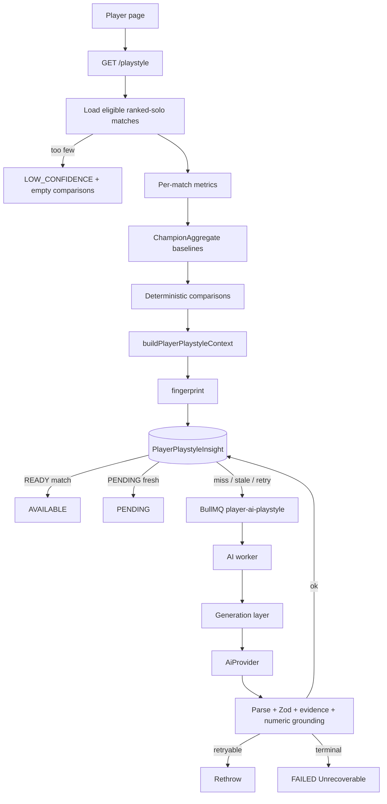

# Milestone 17 Design: Player AI Playstyle Analysis

**Date:** 2026-08-14  
**Status:** Approved with revisions (not implemented)  
**Branch:** `milestone-17-player-ai-playstyle` (from `master` @ `f829ded`, M16 merged)  
**Plan:** `docs/superpowers/plans/2026-08-14-m17-player-ai-playstyle.md`

**Revisions (2026-08-14 review):** (1) slice comparisons use per-match matched baselines, not a modal aggregate; (2) `GOLD_PER_MIN` via ChampionAggregate `totalGoldEarned` + version bump; (3) `NEAR_BASELINE` when `abs(delta) <=` threshold; (4) overall omits KDA (use K/D/A per-game + DPM); slice KDA is ratio-of-sums vs mean matched `aggregateKdaRatio`; (5) enabled-model default `qwen2.5:14b`; (6) fixed 20-match Ranked Solo window, then skip.

---

## 1. Goal

Add **player-specific AI playstyle analysis**: a grounded, concise interpretation of a player's recent ranked performance **relative to League Helper champion/role/rank baselines**.

The LLM is an interpretation layer only. Deterministic League Helper metrics and comparisons remain the source of truth.

The product answers:

> What kind of player is this, statistically, compared with similar-ranked players on the same champions?

It does **not** answer:

> What should this player buy, when should they roam, or what is their personality?

### User-facing features (this milestone)

1. **Deterministic playstyle profile** on the player page: metric comparisons with sample size, baseline scope, and `ABOVE_BASELINE` / `NEAR_BASELINE` / `BELOW_BASELINE` (or not comparable)
2. **AI Playstyle Analysis** that explains the combined pattern in qualitative prose
3. **Champion-slice tendencies** for the player's sufficiently sampled champions, each compared to that champion's own baseline — never a naive cross-champion raw average

### Success criteria

1. Player pages work with `AI_ENABLED=false` and with Qwen down — no 5xx, no missing match history
2. Deterministic comparisons render even when AI is disabled or pending
3. AI never invents, recalculates, or overrides player metrics, baselines, deltas, or directions
4. Generated claims reference only generation-facing evidence handles that were supplied and citable
5. Low-sample / ineligible slices cannot be presented as firm conclusions (preprocessing, not prompt-only)
6. Insights are cacheable by a deterministic fingerprint; page views do not call Qwen synchronously
7. Mixed champion/role samples are never raw-averaged into a single CS/min (or similar) interpretation
8. AI prose is qualitative; the deterministic UI owns numeric display
9. No PUUID, Riot ID, account UUID, email, or API credential is sent to the model
10. Provider transport failures are BullMQ-retryable; schema/grounding failures are terminal

---

## 2. Non-goals

- Prescriptive coaching ("stop fighting", "roam at minute X", "buy this item")
- General-purpose League chatbot, agents, RAG, web search, vector DB
- VOD analysis, live-game coaching, AI rank/MMR prediction
- Toxicity, psychological, or personality profiling unrelated to observable gameplay stats
- Arbitrary composite scores (aggression score, skill score, unofficial ELO)
- AI-calculated statistics
- Champion playstyle / ability-knowledge expansion (future; M16 remains champion-scoped)
- Mainland Chinese servers / undocumented League Client endpoints
- Flex / ARAM / normal-queue playstyle in v1
- Longitudinal trend charts, matchup-specific player weaknesses, improvement plans
- Reusing `PlayerAnalysisReport` / `AnalysisFinding` / `PlayerMetricSnapshot` for this lifecycle (see §5)
- Extending `ChampionAggregate` with **kill participation** (KP remains deferred; see §7.4)
- Changing M16 champion insight prompts, evidence catalogs, or performance context fields (GPM is added to champion **stats** DTOs/aggregates only)

---

## 3. Current repository reality

### 3.1 Player APIs (already shipped)

| Capability                | Contract / location                                                                        |
| ------------------------- | ------------------------------------------------------------------------------------------ |
| Search / profile          | `POST /api/players/search`, `GET /api/players/:playerId`                                   |
| Ranks                     | `GET /api/players/:playerId/ranks` — latest `RankSnapshot` per queue                       |
| Mastery                   | `GET /api/players/:playerId/mastery`                                                       |
| Match history             | `GET /api/players/:playerId/matches` — default limit 20 (`PLAYER_DEFAULT_MATCH_COUNT`)     |
| Refresh                   | `POST /api/players/:playerId/refresh` + refresh-status                                     |
| Queue filter (history UI) | `PlayerMatchQueueCategory`: `all \| ranked_solo \| ranked_flex \| normal \| aram \| other` |
| Default discovery         | All queues (`PLAYER_DEFAULT_MATCH_QUEUE_ID` empty); ranked solo is `420`                   |

There is **no** player-vs-baseline API, **no** player aggregate table, and **no** playstyle endpoint.

Public match cards (`PublicMatchSummary`) expose a **subset** of participant fields. Playstyle must read a dedicated participant projection, not reuse the match-card DTO.

### 3.2 Per-match player fields that actually exist

Stored on `MatchParticipant` (ingestion + timeline metrics). "Public match card" = currently selected in `playerMatchParticipantSelect`.

| Metric                                         | Stored                    | Public match card                           | Notes                                                    |
| ---------------------------------------------- | ------------------------- | ------------------------------------------- | -------------------------------------------------------- |
| Kills / deaths / assists                       | Yes                       | Yes                                         | KDA computed at API boundary (`computePublicKda`)        |
| Win / loss                                     | Yes                       | Yes                                         |                                                          |
| Total CS                                       | Yes                       | Yes                                         | CS/min computed from `gameDurationSeconds` on the card   |
| Gold earned                                    | Yes                       | **No**                                      | Not selected for match cards                             |
| Damage to champions                            | Yes                       | **No**                                      |                                                          |
| Vision score                                   | Yes                       | **No**                                      |                                                          |
| Wards placed / killed / control wards          | Yes                       | **No**                                      |                                                          |
| Kill participation                             | Yes (nullable)            | Yes                                         | Timeline-derived; null when unavailable                  |
| Gold/CS/XP at 10 and 15                        | Yes (nullable)            | Yes (gold/CS/XP; not XP diffs on card)      |                                                          |
| Gold/CS/XP **difference** at 10 and 15         | Yes (nullable)            | Gold/CS diffs yes; **XP diffs not on card** |                                                          |
| Deaths before 10 / 10–20 / before objectives   | Yes (nullable)            | **No**                                      | Timeline-derived                                         |
| `timePlayedSeconds`                            | Yes                       | **No**                                      | Champion aggregates use this for per-minute rates        |
| Champion, queue, duration, remake              | Yes (`Match`)             | Yes                                         |                                                          |
| Normalized position                            | Derived                   | Yes                                         | `normalizeParticipantPosition`; never raw `SOLO`/`DUO_*` |
| `rankTierAtIngestion` + `rankResolutionStatus` | Yes                       | **No**                                      | Ingestion-time rank; not match-start historical truth    |
| Solo kills                                     | **No** on participant     | —                                           | Only on `MatchupAggregate`                               |
| Objective participation                        | **No** as a player metric | —                                           | Team-level `MatchTeam.objectives` JSON only              |
| Gold/min, damage/min, vision/min               | **Not stored as columns** | —                                           | Computable from stored totals + duration                 |

`PlayerMetricSnapshot` / `PlayerAnalysisReport` / `AnalysisFinding` are **schema placeholders only**. No application writer exists. They appear solely in `TRUNCATE TABLE` lists and the ER diagram.

### 3.3 Champion baselines that actually exist

`ChampionAggregate` dimensions:

```text
patch × platformRoute × regionalRoute × queueId × rankTier × teamPosition × championId
(+ sourceNormalizationVersion × aggregationVersion)
```

Materialized rank/position sentinels: exact tier, `ALL` tier, exact position, `ALL` position. Default rollup does **not** materialize `ALL×ALL` or ALL-platform/queue.

Derived metrics (`deriveChampionAggregateMetrics`):

| Baseline metric                                     | Exists                                                                                                                                        |
| --------------------------------------------------- | --------------------------------------------------------------------------------------------------------------------------------------------- |
| sampleSize, wins, winRate, Wilson, sampleConfidence | Yes                                                                                                                                           |
| aggregate KDA                                       | Yes                                                                                                                                           |
| CS/min                                              | Yes                                                                                                                                           |
| damage/min                                          | Yes                                                                                                                                           |
| vision/min                                          | Yes                                                                                                                                           |
| gold diff @10 / @15                                 | Yes (own sample counts)                                                                                                                       |
| CS diff @10 / @15                                   | Yes (own sample counts)                                                                                                                       |
| kills/game, deaths/game, assists/game               | **Derivable** from `totalKills/Deaths/Assists ÷ sampleSize`                                                                                   |
| gold/min                                            | **Not yet** — `MatchParticipant.goldEarned` exists (`Int @default(0)`); `ChampionAggregate` does not accumulate it. M17 adds this (see §7.4). |
| kill participation                                  | **No** — remains deferred                                                                                                                     |
| wards                                               | **No**                                                                                                                                        |
| XP diffs                                            | **No**                                                                                                                                        |
| death timing                                        | **No**                                                                                                                                        |
| solo kills                                          | **No** (matchup table only)                                                                                                                   |

Sample confidence on champion aggregates: `INSUFFICIENT < 30`, `LOW < 100`, `MEDIUM < 500`, `HIGH` (`DEFAULT_SAMPLE_CONFIDENCE_THRESHOLDS`). Ranking floor 30 is a **directory hide** rule, not a player-sample rule.

Rank semantics (must reuse, not reinvent):

- `RANK_TIER_SEMANTICS`: known rank at **ingestion**, may not match rank when the match was played
- Product `RankScope`: `ALL | UNKNOWN | EXACT(tier) | SEGMENT(APEX/HIGH/MID/LOW)`
- Segments are **read-time merges**, not persisted aggregate rows
- Champion public stats still use legacy `tier` (`ALL | exact | UNKNOWN`)
- UNKNOWN rank is hidden from M16 insights (`UNKNOWN_RANK_HIDDEN`)

Champion aggregation eligibility already excludes remakes, incomplete ingestion, missing patch/platform, and structurally invalid participants. Positions are normalized to `TOP | JUNGLE | MIDDLE | BOTTOM | SUPPORT | UNKNOWN`.

### 3.4 M16 AI infrastructure (reuse)

| Piece                                                  | Location                                      | Reuse in M17                                                                                                                                                                                   |
| ------------------------------------------------------ | --------------------------------------------- | ---------------------------------------------------------------------------------------------------------------------------------------------------------------------------------------------- |
| `AiProvider` / `OpenAiCompatibleProvider`              | `packages/ai/src/provider/`                   | Yes, unchanged                                                                                                                                                                                 |
| Generation loop, repair, `AiOutputValidationError`     | `packages/ai/src/generation/`                 | Pattern; player-specific generate function                                                                                                                                                     |
| Evidence handles (`E1`…), citable vs internal          | `packages/ai/src/context/evidence-handles.ts` | Generalize mapping helper                                                                                                                                                                      |
| Numeric grounding (qualitative-only)                   | `packages/ai/src/validation/grounding.ts`     | Same policy; player allowlist = patch identity only                                                                                                                                            |
| Fingerprint sha256 + volatile-key omit                 | `packages/ai/src/context/fingerprint.ts`      | Extract shared canonical helper                                                                                                                                                                |
| `ChampionAiInsight` table + GET/enqueue/PENDING/FAILED | API + worker                                  | **Pattern**, not the table                                                                                                                                                                     |
| Queue `champion-ai-insight`                            | BullMQ                                        | **Do not overload**; new player queue                                                                                                                                                          |
| Env `AI_ENABLED`, `AI_MODEL`, `AI_BASE_URL`, …         | API + worker                                  | Share; do not add a second provider stack                                                                                                                                                      |
| Eval CLI `pnpm ai:eval`                                | `packages/ai/src/eval/`                       | Add player fixtures; keep champion eval                                                                                                                                                        |
| Code default model                                     | `qwen2.5:7b` today                            | M17 changes the shared `AI_MODEL` default to `qwen2.5:14b` (M16 accepted local baseline). `AI_ENABLED` stays `false`. Operators may still override `AI_MODEL`. Fingerprint includes the model. |

M16 future-compat note already said: keep provider/job payload generic so player AI can add a second prompt module + table without rewriting transport.

### 3.5 Frontend

One player route: `apps/web/pages/players/[playerId].vue`.

Current order: Hero → Ranked overview → Mastery → Match list.

Champion AI UI is supplemental (`ChampionAiInsightPanel`): omit when `DISABLED`; poll while `PENDING`; honest empty copy for `LOW_CONFIDENCE` / `UNAVAILABLE`. Reuse that status UX. Poll helper: `apps/web/utils/champion-insights-poll.ts`.

### 3.6 Preserve

Existing player APIs, match-card fields, ranking floor of 30, M16 champion insight prompts/evidence, Riot-key isolation, collected-sample disclaimer, PUUID leak assertions. ChampionAggregate **is** extended in M17 with gold totals (versioned rebuild).

---

## 4. Locked decisions

| Topic                | Decision                                                                                                                                                                                                |
| -------------------- | ------------------------------------------------------------------------------------------------------------------------------------------------------------------------------------------------------- |
| Source of truth      | Deterministic player metrics + ChampionAggregate baselines. AI explains; it does not compute or classify direction.                                                                                     |
| Persistence          | New `PlayerPlaystyleInsight` table mirroring `ChampionAiInsight`. Do **not** reuse `PlayerMetricSnapshot` / `PlayerAnalysisReport` / `AnalysisFinding` (see §5).                                        |
| Package split        | Comparison math in `@league-helper/match-analytics`. AI context/prompt/validation in `@league-helper/ai`. Public DTOs/jobs in `@league-helper/shared`.                                                  |
| Queue                | New BullMQ queue `player-ai-playstyle`, job `GENERATE_PLAYER_PLAYSTYLE_INSIGHT`. Share `AI_*` provider env. Do not put player jobs on `champion-ai-insight`.                                            |
| Serving              | Same OpenAI-compatible provider. Same `AI_ENABLED` hard switch.                                                                                                                                         |
| Model                | Shared `AI_MODEL` **default becomes `qwen2.5:14b`**. `AI_ENABLED` remains `false`. Fingerprint includes `AI_MODEL`.                                                                                     |
| Match window         | Most recent **20 Ranked Solo (`420`) matches by `gameCreation`**, then exclude remake / incomplete / unknown-position from analysis. Do **not** backfill older games. See §9.                           |
| Queue scope          | Ranked Solo only in M17. History UI may still show other queues.                                                                                                                                        |
| Mixed champions      | **Baseline-normalized per-match deltas**, then aggregate. Never raw-average CS/min (or DPM, vision/min, GPM) across champions/roles.                                                                    |
| Overall UI numbers   | Overall profile shows **direction of mean normalized delta**, not a raw blended CS/min. Champion slices show You / Baseline / Δ from matched per-match baselines (see §8.4).                            |
| Comparison metrics   | Only metrics that exist on **both** the player match and `ChampionAggregate` after the M17 gold extension (see §7).                                                                                     |
| KDA                  | **Overall: omit.** Use `KILLS_PER_GAME`, `DEATHS_PER_GAME`, `ASSISTS_PER_GAME`, and `DAMAGE_PER_MIN`. **Slices:** aggregate player KDA from summed K/D/A vs mean of matched `aggregateKdaRatio` values. |
| KP vs baseline       | **Deferred.** Player KP exists; champion baselines do not.                                                                                                                                              |
| GOLD_PER_MIN         | **In M17.** Extend ChampionAggregate with `totalGoldEarned` / `averageGoldPerMinute`, bump `aggregationVersion` `1` → `2`, rebuild.                                                                     |
| Composite scores     | None. No aggression/skill score.                                                                                                                                                                        |
| Win rate             | Sample honesty only. Not a playstyle comparison (winning is not a playstyle).                                                                                                                           |
| Rank for baseline    | Per-match `rankTierAtIngestion` when `RESOLVED_RANKED`. Fallback: same champion+position+patch+queue+platform with `rankTier=ALL`. Never UNKNOWN. Never current `RankSnapshot` as the match baseline.   |
| Baseline eligibility | `sampleConfidence !== INSUFFICIENT` (champion threshold, default 30). Below that → `NOT_COMPARABLE`.                                                                                                    |
| Player sample bands  | Reuse **build** vocabulary, not ranking floor 30: `<5 INSUFFICIENT`, `5–9 EXPLORATORY`, `10–19 CREDIBLE`, `≥20 STRONG`.                                                                                 |
| Direction            | Deterministic near-bands in match-analytics (§8). **`NEAR_BASELINE` iff `abs(delta) <=` threshold.** Qwen never chooses ABOVE/NEAR/BELOW.                                                               |
| Numbers in prose     | Qualitative only. Same M16 grounding: reject unsupported numeric tokens. Player allowlist = matching patch string(s) in scope only (no ability corpus).                                                 |
| Evidence             | Internal canonical IDs stored; generation-facing handles only for `interpretationAllowed=true`. Do not give Qwen forbidden handles (M16 v1.3 lesson).                                                   |
| Generation trigger   | Lazy on-demand. API builds profile+context, fingerprints, returns READY or enqueues. Never call Qwen on the request thread.                                                                             |
| Who builds context   | **API** (player matches + aggregate lookups). Persist `inputContext` on PENDING. Worker is thin generate + validate + persist.                                                                          |
| Redis for insights   | Not in this milestone. Postgres is durable. Player profile Redis cache stays unchanged.                                                                                                                 |
| HTTP                 | **200 + status enum**. **404** unknown player. **400** invalid query. Never 5xx because Qwen failed.                                                                                                    |
| AI disabled          | Still return deterministic comparisons; `ai.status = DISABLED`; omit AI panel in UI (same as M16).                                                                                                      |
| Coaching tone        | Descriptive only. Output field is `tradeoffs`, not `recommendations` / "areas to improve".                                                                                                              |
| Privacy              | Model sees `"player"` + champion names/keys for slices + qualitative/comparison flags. No PUUID, Riot ID, account/player UUIDs, emails, match UUIDs, or internal row ids.                               |
| Enabled default      | `AI_ENABLED=false`. App and tests must pass without a model process.                                                                                                                                    |

---

## 5. Persistence decision (PlayerMetricSnapshot / PlayerAnalysisReport / AnalysisFinding)

### What they are

Reserved under Prisma comment `Coaching / analysis (future)`:

- `PlayerMetricSnapshot`: JSON `metrics` blob keyed by account + optional champion/opponent/patch/queue/role. No fingerprint, no inputContext, no provider/model/promptVersion.
- `PlayerAnalysisReport`: `PLAYER_OVERVIEW | CHAMPION_FOCUS | MATCHUP_FOCUS`; `PENDING|READY|FAILED|EXPIRED`; unstructured `deterministicSummary` + `aiSummary`; required FK to a snapshot.
- `AnalysisFinding`: category/title/severity/confidence + `playerValue`/`peerValue`/`percentile` + `recommendations` JSON.

M16 explicitly did **not** reuse these for champion insights.

### Why they are the wrong lifecycle for M17

M17 needs the proven M16 row shape: `contextFingerprint`, `inputContext`, `structuredResult`, `promptVersion`, `provider`, `model`, `PENDING|READY|FAILED`, unique scope+fingerprint, BullMQ job by fingerprint.

Adapting the unused coaching tables would be a breaking rewrite: add fingerprint uniqueness, drop/ignore `recommendations`, replace `aiSummary` with structured JSON, and still not match `ChampionAiInsight`. `AnalysisFinding.recommendations` is prescriptive — the opposite of M17 tone.

### Decision

**Create `PlayerPlaystyleInsight`.** Leave the three coaching tables untouched for a later coaching milestone that may want findings + recommendations.

Do not write `PlayerMetricSnapshot` in M17. The deterministic profile lives in the GET response and in `inputContext` JSON on the insight row (same as M16).

---

## 6. Architecture

```text
Player match history (Ranked Solo, last 20 eligible)
        ↓
per-match player metrics (match-analytics)
        ↓
ChampionAggregate lookup (champion × position × rank/ALL × patch × queue × platform)
        ↓
per-match metric deltas (only when baseline comparable)
        ↓
aggregate overall (mean delta) + champion slices (raw vs baseline)
        ↓
deterministic direction classification
        ↓
Player playstyle context (@league-helper/ai)
        ↓
fingerprint → PostgreSQL PlayerPlaystyleInsight
        ↓
  READY + same fingerprint → AVAILABLE
  else enqueue GENERATE_PLAYER_PLAYSTYLE_INSIGHT
        ↓
worker: load inputContext → generate + Zod + evidence + numeric grounding
        ↓
GET /api/players/:playerId/playstyle
        ↓
player page: comparison cards (always) + AI panel (supplemental)
```



| Package / app                    | Responsibility                                                                                                                     |
| -------------------------------- | ---------------------------------------------------------------------------------------------------------------------------------- |
| `@league-helper/shared`          | Public Zod DTOs, job payload, queue names, prompt version constant, near-band **names** only if they must appear in the public API |
| `@league-helper/match-analytics` | Per-match metric extraction, near-bands, direction classification, sample bands, delta aggregation. **No LLM.**                    |
| `@league-helper/ai`              | Player context builder, evidence catalog, generation-facing handles, prompts, generate/validate/repair, eval fixtures              |
| `@league-helper/api`             | Match load, aggregate lookup, profile assembly, GET, enqueue, persistence                                                          |
| `@league-helper/worker`          | BullMQ consumer: generate from stored context, persist, retryable vs terminal                                                      |
| `@league-helper/web`             | Comparison cards + AI panel on the player page                                                                                     |

---

## 7. Deterministic metric and baseline design

### 7.1 M17 comparison set (both sides exist)

| Metric id          | Player source                                         | Baseline source                        | Overall | Slice |
| ------------------ | ----------------------------------------------------- | -------------------------------------- | ------- | ----- |
| `KILLS_PER_GAME`   | mean kills                                            | `totalKills / sampleSize`              | Yes     | Yes   |
| `DEATHS_PER_GAME`  | mean deaths                                           | `totalDeaths / sampleSize`             | Yes     | Yes   |
| `ASSISTS_PER_GAME` | mean assists                                          | `totalAssists / sampleSize`            | Yes     | Yes   |
| `CS_PER_MIN`       | `totalCs / (seconds/60)`                              | `averageCsPerMinute`                   | Yes     | Yes   |
| `GOLD_PER_MIN`     | `goldEarned / (seconds/60)`                           | `averageGoldPerMinute` (M17 aggregate) | Yes     | Yes   |
| `DAMAGE_PER_MIN`   | `totalDamageDealtToChampions / (seconds/60)`          | `averageDamagePerMinute`               | Yes     | Yes   |
| `VISION_PER_MIN`   | `visionScore / (seconds/60)`                          | `averageVisionScorePerMinute`          | Yes     | Yes   |
| `GOLD_DIFF_AT_10`  | `goldDifferenceAt10`                                  | `averageGoldDifferenceAt10`            | Yes     | Yes   |
| `GOLD_DIFF_AT_15`  | `goldDifferenceAt15`                                  | `averageGoldDifferenceAt15`            | Yes     | Yes   |
| `CS_DIFF_AT_10`    | `csDifferenceAt10`                                    | `averageCsDifferenceAt10`              | Yes     | Yes   |
| `CS_DIFF_AT_15`    | `csDifferenceAt15`                                    | `averageCsDifferenceAt15`              | Yes     | Yes   |
| `KDA`              | slice: `computeAggregateKdaRatio` on **summed** K/D/A | mean of matched `aggregateKdaRatio`    | **No**  | Yes   |

Per-minute rates for **comparison** use `timePlayedSeconds` when `> 0`, else `gameDurationSeconds`. This matches champion aggregation (`gameSeconds` ← `timePlayedSeconds`), not the match-card CS/min helper (which uses `gameDurationSeconds`). Do not change the public match-card formula in M17.

A per-match metric that is null (typical for timeline diffs) is omitted from that metric's comparable set. Partial metric eligibility is required.

**Overall must not include `KDA`.** Mean of per-match KDA is not comparable to `aggregateKdaRatio` (ratio of sums). Overall combat uses K/D/A per-game + DPM.

**Slice `KDA`** is the exception to mean-of-per-match-player-values: `playerValue = computeAggregateKdaRatio(n, ΣK, ΣD, ΣA)` over comparable slice matches; `baseline.value` = mean of those matches' selected `aggregateKdaRatio`; `delta = playerValue - baseline.value`. Do not mean per-match player KDAs.

### 7.2 Player-only metrics (never compared in M17)

These exist on the participant but **must not** produce `ABOVE_BASELINE` / `BELOW_BASELINE` evidence:

- kill participation
- wards placed/killed/control wards
- XP diffs
- death timing (`deathsBefore10`, etc.)

Lock: **omit from the public playstyle DTO in v1**. Gold/min is **not** in this list after §7.4.

### 7.3 Explicitly out of comparison

- Win rate (sample honesty only: `matchesAnalyzed`, `wins`)
- Overall `KDA` (see §7.1)
- Solo kills, objectives, composite aggression
- Unofficial MMR / ELO
- Mastery points (affinity, not recent playstyle)

### 7.4 Prerequisite analytics **in** M17: gold per minute

There is **no repository blocker**. `MatchParticipant.goldEarned` is already a required non-negative integer. Champion aggregation already uses `timePlayedSeconds` as `gameSeconds`.

M17 **must**:

1. Add `goldEarned` to `ChampionAggregateContribution` and structural eligibility
2. Add `totalGoldEarned Int @default(0)` on `ChampionAggregate`
3. Accumulate like `totalDamageToChampions` (always present; not a nullable sample-count field)
4. Derive `averageGoldPerMinute = totalGoldEarned / (totalGameSeconds / 60)` in `deriveChampionAggregateMetrics`
5. Expose `averageGoldPerMinute` on `ChampionAggregateMetricsSchema` and `mapAggregateMetrics`
6. Bump default `CHAMPION_AGGREGATION_VERSION` from `1` to `2` (API + worker + `.env.example`)
7. Rebuild champion aggregates (`pnpm aggregates:rebuild-champions --confirm`) so version-2 rows have real gold totals — version-1 rows must not be read as if gold were zero-from-default

Do **not** add GPM to M16 `ChampionInsightPerformanceSchema` / champion insight prompts (explicit field list; leave unchanged).

Kill participation stays deferred: it is nullable, needs its own sample count, and is not required once GPM + CS/min + DPM exist for farm-vs-fight.

M17 fight-vs-farm language may cite CS/min, GPM, and DPM when those comparisons are citable. "Higher kill participation than Ahri baseline" remains **forbidden**.

### 7.5 Alternatives considered

| Approach                                             | Why not                                                                                                                                     |
| ---------------------------------------------------- | ------------------------------------------------------------------------------------------------------------------------------------------- |
| Raw-average all recent games                         | Mixes support CS with ADC CS. Invalid.                                                                                                      |
| Analyze only a selected champion+role                | Cleaner, but hides overall tendency and requires a picker the player page does not have. Champion slices still exist as a **second** layer. |
| On-the-fly peer scan of all `MatchParticipant` rows  | Duplicates ChampionAggregate; too expensive on GET.                                                                                         |
| Rank SEGMENT merge for baselines                     | Segments are not materialized; M16 champion page still uses legacy `tier`. Exact then ALL-tier fallback is the existing materialized path.  |
| Extend coaching tables                               | Wrong lifecycle; see §5.                                                                                                                    |
| Modal ChampionAggregate for a slice                  | Compares a multi-patch/rank player mean to one aggregate row. Invalid. Use matched per-match baselines.                                     |
| Mean per-match KDA vs `aggregateKdaRatio` on overall | Ratio-of-sums vs mean-of-ratios. Omit overall KDA; use K/D/A per-game + DPM.                                                                |

---

## 8. Comparison classification

Conceptual type (names follow repo conventions; exact Zod lives in shared):

```ts
type PlayerMetricComparison = {
  metric: PlayerPlaystyleMetricId;
  playerValue: number | null; // raw mean; null on mixed overall profile
  baseline: {
    value: number;
    sampleSize: number;
    sampleConfidence: SampleConfidence;
    rankTier: ChampionStatsTierFilter; // exact or ALL
    usedAllTierFallback: boolean;
  } | null;
  delta: number | null; // player − baseline, or mean per-match delta on overall
  comparableMatchCount: number;
  direction: 'ABOVE_BASELINE' | 'NEAR_BASELINE' | 'BELOW_BASELINE' | 'NOT_COMPARABLE';
  interpretationAllowed: boolean;
};
```

### 8.1 Near-bands

`ChampionAggregate` stores **no variance**. Z-scores are impossible. Directions use documented absolute near-bands in `@league-helper/match-analytics`:

| Metric             | `NEAR_BASELINE` iff `abs(delta) <=` |
| ------------------ | ----------------------------------- |
| `CS_PER_MIN`       | 0.40                                |
| `GOLD_PER_MIN`     | 25                                  |
| `DAMAGE_PER_MIN`   | 40                                  |
| `VISION_PER_MIN`   | 0.12                                |
| `KDA`              | 0.35                                |
| `KILLS_PER_GAME`   | 0.60                                |
| `DEATHS_PER_GAME`  | 0.40                                |
| `ASSISTS_PER_GAME` | 0.80                                |
| `GOLD_DIFF_AT_10`  | 120                                 |
| `GOLD_DIFF_AT_15`  | 180                                 |
| `CS_DIFF_AT_10`    | 4                                   |
| `CS_DIFF_AT_15`    | 6                                   |

Equality at the threshold is **NEAR**, not ABOVE/BELOW. Example: CS/min delta `-0.40` → `NEAR_BASELINE`; `-0.41` → `BELOW_BASELINE`. `delta === 0` → `NEAR_BASELINE`.

Otherwise `ABOVE_BASELINE` if delta > threshold, `BELOW_BASELINE` if delta < `-threshold`.

These bands are product constants, not empirically fitted. They exist so Qwen cannot invent "above". They may be tuned in a later analytics pass without changing AI architecture.

### 8.2 `interpretationAllowed`

True only when **all** hold:

1. `direction` is `ABOVE_BASELINE`, `NEAR_BASELINE`, or `BELOW_BASELINE`
2. `comparableMatchCount` ≥ `PLAYER_PLAYSTYLE_EXPLORATORY_MIN` (5)
3. Baseline `sampleConfidence !== 'INSUFFICIENT'`
4. For champion slices, slice match count ≥ 5

`NOT_COMPARABLE` ⇒ `interpretationAllowed = false`. Metric is omitted from generation-facing evidence.

### 8.3 Baseline lookup per match

For each eligible match:

1. Normalize position. If `UNKNOWN`, match is ineligible for comparison (keep in "skipped" counts).
2. Require `normalizedPatch`, platform, ranked-solo queue, completed, not remake, structurally valid K/D/A/CS/damage/vision/**goldEarned**.
3. Lookup `ChampionAggregate` at exact: `patch, platform, queueId=420, rankTier=rankTierAtIngestion, position, championId` when `rankResolutionStatus === RESOLVED_RANKED` and tier parses.
4. If missing or `sampleConfidence === INSUFFICIENT`, lookup same key with `rankTier=ALL`.
5. If still missing/insufficient, that **match** contributes no comparable deltas (counts toward analyzed matches but not comparableMatchCount for those metrics).
6. Never look up `UNKNOWN` rank rows. Never use `ALL` position for a known position.

`usedAllTierFallback` is true when step 4 was used. Scope evidence must say so (rank-unaware comparison).

Current `RankSnapshot` is **display context only** (player already sees it in Ranked overview). It must not select the baseline.

### 8.4 Overall vs champion slices

**Overall**

- Window: §9 (fixed 20 Ranked Solo, then skip)
- Metrics: §7.1 overall column only — **no `KDA`**
- For each comparison metric: mean of **per-match deltas** among matches where that metric was comparable
- `playerValue` is **null** (prevents displaying a blended 5.2 CS/min)
- `baseline.value` is **null** on overall (mean of heterogeneous champion baselines is not a displayable number)
- `delta` is the mean per-match delta
- `usedAllTierFallback` is true if **any** comparable match for that metric used ALL-tier
- `baseline.sampleSize` / `sampleConfidence` on overall: use the **minimum** sampleSize among matched baselines (conservative); confidence from that minimum via `classifySampleConfidence`
- Direction from mean delta vs near-band (`<=` threshold)
- Mix summary: counts by `championKey+position`

**Champion slices**

- Group by `championId + normalized position` among **analyzed** matches (post-skip, §9)
- Include a slice when analyzed match count ≥ 5
- Max **3** slices, highest match count, tie-break by most recent game
- **Do not use a modal ChampionAggregate row.** For each metric, using only matches in the slice where that metric was comparable against the **per-match selected baseline** (exact then ALL, §8.3):
  - `playerValue` = mean of those per-match player values  
    **except `KDA`:** `computeAggregateKdaRatio(n, ΣK, ΣD, ΣA)` on those matches
  - `baseline.value` = mean of those matches' selected baseline values (`averageCsPerMinute`, `averageGoldPerMinute`, …; for KDA, mean of selected `aggregateKdaRatio`)
  - `delta` = mean of per-match `(player − baseline)` for non-KDA metrics; for `KDA`, `playerValue - baseline.value`
  - `comparableMatchCount` = number of matches in that mean
  - `usedAllTierFallback` = true if any of those matches used ALL-tier
  - `baseline.sampleSize` = minimum sampleSize among those matched aggregate rows
- If a metric has no comparable matches in the slice → `NOT_COMPARABLE`
- UI shows You / Baseline / Δ from these means, plus comparable count / min baseline sample size

If a player has 10 Ahri Mid + 10 Jinx Bottom, overall is normalized-delta based (no raw CS/min, no overall KDA); two champion slices carry matched-baseline means. The spec **does not** emit a single overall raw CS/min.

### 8.5 Sample thresholds

| Band         | Player matches (overall comparable, or slice count) | Overall playstyle | Champion slice                              | AI                                                                   |
| ------------ | --------------------------------------------------- | ----------------- | ------------------------------------------- | -------------------------------------------------------------------- |
| INSUFFICIENT | 0–4                                                 | No profile        | Omit slice                                  | `LOW_CONFIDENCE`, no enqueue                                         |
| EXPLORATORY  | 5–9                                                 | Profile + warning | Slice allowed, `CONFIDENCE_WARNING` citable | May generate; statistical claims must cite warning + allowed metrics |
| CREDIBLE     | 10–19                                               | Full              | Full                                        | Generate                                                             |
| STRONG       | ≥20                                                 | Full              | Full                                        | Generate                                                             |

Overall eligibility uses **comparable** match count (analyzed matches that produced at least one comparable metric), not the raw 20-window size. A window of 20 with 15 remakes and 5 comparable games is EXPLORATORY. Do not pull older matches to replace skips.

Baseline uses existing champion `sampleConfidence`, independent of player bands.

Partial metrics: overall may have `CS_PER_MIN` citable and `GOLD_DIFF_AT_10` `NOT_COMPARABLE` (few timelines). Generation eligible if **any** comparison is interpretation-allowed. Ineligible metrics must not be cited as statistical conclusions.

---

## 9. Match selection

Lock a **fixed transparent window**, then skip. Do not fetch “20 eligible” by walking past remakes.

1. Load the **20 most recent Ranked Solo (`queueId = 420`) matches** for the account by `gameCreation` descending. Include remakes and incomplete ingestions. If fewer than 20 ranked-solo matches exist, the window is that smaller set. **Never backfill** older matches to replace skipped rows.
2. Classify each window row with **mutually exclusive** first-match reasons:

| Order | Condition                                                                                 | Bucket                                             |
| ----- | ----------------------------------------------------------------------------------------- | -------------------------------------------------- |
| 1     | `remake === true`                                                                         | `skipped.remake`                                   |
| 2     | `ingestionStatus !== COMPLETED`                                                           | `skipped.incomplete`                               |
| 3     | Normalized position is `UNKNOWN`                                                          | `skipped.unknownPosition`                          |
| 4     | Missing `normalizedPatch` / platform, or structurally invalid K/D/A/CS/damage/vision/gold | `skipped.incomplete` (same bucket; not analyzable) |
| 5     | Otherwise                                                                                 | **analyzed**                                       |

3. Among **analyzed** matches, look up baselines (§8.3). Matches with **zero** comparable metrics → `skipped.noBaseline` (these remain in `matchesAnalyzed`).
4. `comparableMatchCount` = analyzed matches with at least one comparable metric.

Invariant (let `windowSize` = rows fetched, `≤ 20`):

```text
skipped.remake + skipped.incomplete + skipped.unknownPosition + matchesAnalyzed = windowSize
skipped.noBaseline ≤ matchesAnalyzed
comparableMatchCount = matchesAnalyzed - skipped.noBaseline
```

| Rule                  | M17 lock                                                                                    |
| --------------------- | ------------------------------------------------------------------------------------------- |
| Queue                 | Ranked Solo `420` only                                                                      |
| Window                | 20 most recent ranked-solo by `gameCreation`, **then** skip                                 |
| Early surrender       | Included in the window; analyzed if not remake and completed (same as champion aggregation) |
| Patch                 | Each match keeps its `normalizedPatch`; not filtered to "current" patch                     |
| Champion / role query | None in v1                                                                                  |
| Incomplete timeline   | Analyzed match stays; timeline-only metrics null / not comparable                           |

Do not send skip internals to Qwen beyond `CONFIDENCE_WARNING` / mix identity.

If `comparableMatchCount < 5`: `LOW_CONFIDENCE` + `INSUFFICIENT_SAMPLE` (deterministic cards omitted). Player page otherwise unchanged.

---

## 10. AI context, evidence, and grounding

### 10.1 Context contents (generation-facing after handle mapping)

Include:

- `subject: { label: "player" }` — never Riot ID
- Scope: queue label/id 420, collected-sample kind, patch range (min–max of analyzed matches), platform **omitted from generation payload** (M16 strips platform from prose; do not give it a reason to leak)
- Mix summary: up to 8 `{ championKey, championName, position, matchCount }`
- Player sample: `matchesAnalyzed`, `comparableMatchCount`, `wins`, player band, `generationEligible`
- Overall comparisons: only metrics with a direction; include `direction`, `interpretationAllowed`, `usedAllTierFallback`, `comparableMatchCount`. Include numeric `delta` in **internal** context for tests; **strip numeric delta/player/baseline values from generation-facing payload** so the model cannot restate them. Generation-facing comparison rows are qualitative: metric id, direction, allowed flag, fallback flag.
- Champion slices: same qualitative comparisons plus championKey/name/position/matchCount/band. Max 3.
- Output policy: which sections are allowed (`economyAllowed`, `combatAllowed`, `championTendenciesAllowed`)

Exclude:

- PUUID, `externalAccountId`, player UUID, account UUID, match UUID, insight row id
- Riot ID, email, summoner id
- Icon URLs, item ids, rune ids
- Raw match list
- `interpretationAllowed=false` evidence handles (omit from generation catalog entirely)
- Win-rate comparison
- Player-only metrics from §7.2

### 10.2 Canonical evidence IDs (internal)

```text
SCOPE_QUEUE
SCOPE_PATCH_RANGE
SCOPE_MIX
CONFIDENCE_WARNING
OVERALL_CS_PER_MIN
OVERALL_GOLD_PER_MIN
OVERALL_DAMAGE_PER_MIN
OVERALL_VISION_PER_MIN
OVERALL_KILLS_PER_GAME
OVERALL_DEATHS_PER_GAME
OVERALL_ASSISTS_PER_GAME
OVERALL_GOLD_DIFF_AT_10
OVERALL_GOLD_DIFF_AT_15
OVERALL_CS_DIFF_AT_10
OVERALL_CS_DIFF_AT_15
SLICE_<championKey>_<POSITION>_CS_PER_MIN
SLICE_<championKey>_<POSITION>_GOLD_PER_MIN
SLICE_<championKey>_<POSITION>_KDA
SLICE_<championKey>_<POSITION>_DAMAGE_PER_MIN
… (slice suffixes = overall suffixes **plus** `KDA`; there is **no** `OVERALL_KDA`)
```

`interpretationAllowed` per id follows §8.2 for that metric/slice.

`SCOPE_*` and `CONFIDENCE_WARNING` are always citable and **never** unlock a statistical conclusion by themselves.

Do **not** create separate `PLAYER_*` / `BASELINE_*` / `*_COMPARISON` ids. The comparison **is** the evidence. Splitting them would invite Qwen to cite a player value without the baseline.

### 10.3 Generation-facing handles (M16 v1.3)

Internal catalog may include disallowed ids for tests and stored debug.

Generation payload:

- Assign `E1`… only to `interpretationAllowed=true` entries
- Do not send `interpretationAllowed=false` handles
- Stored insight evidence arrays use **canonical ids** after handle resolution (same as M16)

### 10.4 Structured output

```ts
type GroundedClaim = {
  text: string; // 40–400, plain text
  evidence: string[]; // min 1, canonical ids after resolution
};

type PlayerPlaystyleStoredInsight = {
  summary: GroundedClaim; // 80–600
  economy: GroundedClaim | null;
  combat: GroundedClaim | null;
  strengths: GroundedClaim[]; // max 3
  tradeoffs: GroundedClaim[]; // max 3, descriptive
  championTendencies: Array<{
    championKey: string;
    position: ChampionRankingPosition;
    text: string; // 40–500
    evidence: string[];
  }>; // max 3; only eligible slices
};
```

Section optionality:

| Section                   | When allowed                                                                                                    |
| ------------------------- | --------------------------------------------------------------------------------------------------------------- |
| `summary`                 | Always required if `generationEligible`                                                                         |
| `economy`                 | Any of CS/min, gold/min, vision/min, gold/CS diffs interpretation-allowed                                       |
| `combat`                  | Any overall K/D/A per-game or DPM interpretation-allowed (not overall KDA)                                      |
| `strengths` / `tradeoffs` | Optional; each claim must cite at least one allowed statistical id                                              |
| `championTendencies`      | Only for slices in context with at least one allowed metric; `championKey+position` must match a supplied slice |

Public DTO strips evidence arrays. Server stamps `generatedAt`.

### 10.5 Numeric grounding

Same M16 qualitative policy.

Allowlist: patch strings present in `SCOPE_PATCH_RANGE` (e.g. `14.16`, `25.15`) only.

Reject: CS/min, DPM, KDA, deltas, sample sizes, percentages, win counts, any other digits.

Word-form quantities ("slightly below", "more fight-oriented") are allowed.

Reject HTML.

### 10.6 Prompt rules (must state)

- Explain League Helper collected-sample comparisons. You are not a source of stats.
- Never invent or recalculate metrics. Never choose ABOVE/NEAR/BELOW; those are given.
- Do not restate statistics as numbers.
- Do not give live-game or build advice. Describe patterns, not instructions.
- Do not claim personality, toxicity, or rank prediction.
- Do not treat mixed-role overall as a raw farming number; it is a baseline-adjusted tendency.
- If `usedAllTierFallback`, do not claim a precise exact-tier peer group.
- Return JSON only.

Prompt version constant: `PLAYER_PLAYSTYLE_PROMPT_VERSION = 'player-playstyle-v1'` (code constant, not env).

### 10.7 Privacy minimum

Qwen needs: qualitative directions, champion names for slices, positions, sample-band language, mix counts as **words** if needed ("several champions") — prefer not sending raw match counts as digits (numeric grounding would reject "12 games" anyway). Mix summary in generation payload should use champion names + positions without numeric counts, **or** counts must be excluded from prose via grounding. Lock: generation-facing mix entries omit integer counts; `SCOPE_MIX` is citable as "multiple champions/roles" identity. Internal context may keep counts for tests/fingerprint.

Fingerprint hashes the **internal** context (with numbers), not the stripped generation payload. That way numeric profile changes invalidate cache even though Qwen never sees the numbers.

---

## 11. Fingerprint and lifecycle

```text
fingerprint = sha256(
  canonicalJson(internalContext) + '\0' + promptVersion + '\0' + model + '\0' + provider
)
```

Canonical JSON: sorted keys, omit `undefined`, omit volatile timestamps (`calculatedAt`, `latestEligibleMatchAt`, `generatedAt`).

Internal context **must** include: playerAccountId is **not** hashed as a raw UUID in the JSON sent to Qwen, but the fingerprint is scoped in Postgres by `playerAccountId + queueId + fingerprint`. Include analyzed match identity as **sorted matchId+participantId pairs in the hashed internal context** so new games invalidate. Those ids stay out of the generation payload.

### GET `/api/players/:playerId/playstyle`

1. 404 if player account not found (same as profile)
2. Load the fixed Ranked Solo window (§9); build deterministic profile (always)
3. If AI disabled → 200 with comparisons + `ai.status=DISABLED`
4. If not `generationEligible` → 200 comparisons (may be empty) + `ai.status=LOW_CONFIDENCE`
5. Fingerprint; lookup row
6. READY + parseable structuredResult → `AVAILABLE`
7. Fresh PENDING → `PENDING`
8. Fresh FAILED → `UNAVAILABLE` + `GENERATION_FAILED`
9. Else upsert PENDING with `inputContext` = **generation payload + enough internal context for the worker to validate** (store the internal context; worker does not need to hide handles from itself). Enqueue job id `ai_player_` + fingerprint prefix.
10. Return 200 `PENDING`

Worker: same M16 split — retryable `AiProviderError` rethrown; terminal `AiOutputValidationError` → `markFailed` + `UnrecoverableError`. Exhausted retries FAILED in `failed` handler.

Stale PENDING / FAILED retry windows: reuse `CHAMPION_AI_INSIGHT_STALE_PENDING_MS` / `FAILED_RETRY_MS` values via shared AI config or duplicate identically named `PLAYER_AI_PLAYSTYLE_*` env with the same defaults (120s / 60s). Lock: **new env names** with the same defaults so champion and player cooldowns can diverge later.

---

## 12. API

```text
GET /api/players/:playerId/playstyle
```

No required query in v1. Player id is the public UUID (`PublicPlayer.id`), same as other player routes.

Response envelope (conceptual):

```ts
{
  disclaimer: CHAMPION_STATS_DISCLAIMER, // collected-sample sentence, reused
  aiDisclaimer: PLAYER_PLAYSTYLE_AI_DISCLAIMER,
  rankSemantics: RANK_TIER_SEMANTICS,
  sampleScope: {
    kind: 'COLLECTED_SAMPLE',
    queueId: 420,
    matchWindow: 20,
    windowSize: number,              // rows fetched, ≤ 20
    matchesAnalyzed: number,
    comparableMatchCount: number,
    wins: number,
    playerSampleBand: 'INSUFFICIENT' | 'EXPLORATORY' | 'CREDIBLE' | 'STRONG',
    patchRange: { min: string; max: string } | null,
  },
  mix: Array<{ championKey, championName, position, matchCount }>,
  overall: { comparisons: PlayerMetricComparison[] },
  championSlices: Array<{
    championKey, championName, position, matchCount, sampleBand, comparisons
  }>,
  skipped: { remake: number, incomplete: number, unknownPosition: number, noBaseline: number },
  ai: {
    status: 'DISABLED' | 'PENDING' | 'AVAILABLE' | 'UNAVAILABLE' | 'LOW_CONFIDENCE',
    emptyReason?: 'INSUFFICIENT_SAMPLE' | 'INSUFFICIENT_EVIDENCE' | 'GENERATION_FAILED' | 'QUEUE_UNAVAILABLE' | 'AI_DISABLED',
    insight: null | {
      summary: string,
      economy: string | null,
      combat: string | null,
      strengths: string[],
      tradeoffs: string[],
      championTendencies: Array<{ championKey, position, text }>,
      generatedAt: string,
    }
  }
}
```

Rate limiting: reuse existing public API limiter on `PlayersController`. CORS/headers unchanged.

Do not add this payload onto `GET /api/players/:playerId` (profile cache would mix AI PENDING with identity). Keep a dedicated endpoint.

---

## 13. Frontend

Place a **Your playstyle** section on `pages/players/[playerId].vue` **after Ranked overview and before Mastery**. Rank is the comparison context; mastery is unrelated affinity.

Components:

- `PlayerPlaystylePanel.vue` — sample band, mix chips, overall direction rows grouped Farming / Combat / Vision / Early lane, champion-slice tables with You / Baseline / Δ / direction, collected-sample + rank-semantics footnotes
- `PlayerPlaystyleAiPanel.vue` — clone of champion panel status behavior; headings: Playstyle summary, Economy, Combat, Strengths, Tradeoffs, Champion tendencies
- Poll with the existing delay helper (extract if needed to a generic `ai-insight-poll.ts`, or duplicate the three functions with player names — prefer extracting shared poll util)

`DISABLED`: omit AI panel; still show deterministic cards when `playerSampleBand !== INSUFFICIENT`.

`INSUFFICIENT`: one honest line ("Not enough recent Ranked Solo games for a playstyle profile.") — do not show fake directions.

Numbers: overall rows show direction labels only (Below / Near / Above baseline) plus comparable match count. Champion slices show numeric You / Baseline / Δ from **matched per-match baseline means** (not a single modal aggregate), with comparable count and min baseline sample size.

No evidence IDs in the DOM. No HTML from the model. `v-text` / interpolation only.

Player page continues to function if the playstyle GET fails: show a non-blocking banner, do not replace match history.

---

## 14. Security / privacy

- Validate `playerId` as UUID (`ParseUUIDPipe`)
- Never log PUUID or Riot ID in AI worker logs (reuse `safeJobId`)
- `assertNoPuuidLeak` on the playstyle response
- `AI_API_KEY` remains server-only; never `NUXT_PUBLIC_*`
- Generation payload privacy rules in §10.7
- Do not persist prompts with identifiers beyond stored `inputContext` (already stripped)

---

## 15. Evaluation

Offline (CI-safe, no model):

Fixtures under `packages/ai/src/eval/fixtures/player-playstyle/*.json` plus pure match-analytics tests for direction/sample/normalization.

Required cases (only using §7.1 metrics):

1. High CS/min + GPM delta, low DPM delta → farm-leaning
2. Low CS/min + GPM delta, high DPM + assists → fight-leaning
3. Slice high KDA, low DPM (overall has no KDA) → efficient/low-volume combat on that champion
4. High deaths + high DPM/assists → high-activity, high-risk
5. All near-band including `abs(delta) ===` threshold → balanced / NEAR
6. Strong early GD/CSD@10; overall combat from K/D/A per-game + DPM (no overall KDA)
7. Weak early diffs, overall DPM/kills near or above
8. Insufficient sample (`comparableMatchCount < 5`) inside a 20-window with many remake skips — do not backfill
9. One champion ≥5, another <5 — only first slice emitted
10. Mixed roles (support + ADC) — overall has null raw CS/min and null overall KDA; slices differ; slice CS/min uses mean of matched baselines not a modal row
11. Metric conflict (CS above, DPM below) — both citable; no forced single label
12. Exact-tier baseline insufficient, ALL-tier used — `usedAllTierFallback`
13. Player metric would be above but comparableMatchCount < 5 — `NOT_COMPARABLE`
14. Champion slice profile disagrees with overall mean delta
15. Timeline diffs missing on most games — early-lane metrics not comparable; combat still eligible
16. `interpretationAllowed=false` ids must not appear as generation handles; no `OVERALL_KDA` handle exists
17. Numeric prose in a fake model output is rejected
18. Window identity: 20 fetched, skips sum with `matchesAnalyzed` to `windowSize`
19. GPM comparable after version-2 aggregate; version-1 / missing gold baseline → `NOT_COMPARABLE` for GPM only

Live (`pnpm ai:eval:playstyle -- --live`): same metrics as M16 live eval; do not fail CI offline on model quality. Default live model: `AI_MODEL` default `qwen2.5:14b`.

---

## 16. Future compatibility

M17 is a foundation for later:

- Prescriptive coaching (then `AnalysisFinding.recommendations` may become relevant)
- Matchup-specific player weaknesses
- Longitudinal trends
- Champion-specific coaching
- ChampionAggregate **kill participation** extension
- Flex queue / selectable champion filter

Do not implement those now. Do not turn the player page into a chatbot.

M16 champion insights stay constrained; richer champion knowledge is not M17.

---

## 17. Answers to the required questions

1. **What player metrics already exist?** See §3.2. Per-match K/D/A, CS, gold earned, damage, vision, wards, KP, early gold/CS/XP and diffs, death timing, duration, champion, role, queue, win, ingestion rank.
2. **Additional deterministic metrics before AI?** Direction classification, normalized deltas, player sample bands, **and** ChampionAggregate `totalGoldEarned` / `averageGoldPerMinute` with `aggregationVersion` `2` + rebuild. **Do not** add KP. **Do not** invent composite scores.
3. **What baseline data exists?** `ChampionAggregate` derived metrics in §3.3, plus M17 GPM. Dimensions patch/platform/queue/rank/position/champion.
4. **Can champion aggregates provide rank/champion/position comparison?** Yes, via exact tier then ALL-tier fallback. Not via unmaterialized SEGMENT unless we merge at read time (deferred).
5. **Per champion, per role, overall normalized, or combination?** Overall = normalized per-match deltas (no KDA, no raw playerValue). Up to 3 champion+position slices with **mean of matched per-match baselines** (not modal). Slice KDA = ratio-of-sums vs mean matched `aggregateKdaRatio`.
6. **Avoid invalid raw averaging?** Overall public `playerValue` and `baseline.value` are null; only mean delta is classified. Slices are single champion+position using paired per-match baselines.
7. **Sample thresholds?** Player: 5 / 10 / 20 bands on `comparableMatchCount`. Baseline: existing INSUFFICIENT&lt;30. Fixed 20-window then skip; no backfill. See §8.5 and §9.
8. **Reuse PlayerMetricSnapshot / Report / Finding?** No. New `PlayerPlaystyleInsight`. §5.
9. **Persisted vs on demand?** Deterministic profile computed on GET. AI persisted by fingerprint. No precompute crawler.
10. **Fingerprint?** Canonical internal context + promptVersion + model + provider. Scoped by playerAccountId + queueId.
11. **Evidence IDs?** §10.2. No `OVERALL_KDA`.
12. **Visible to Qwen?** Only citable handles for `interpretationAllowed=true`. Qualitative comparison rows, no numeric values.
13. **Optional output sections?** Economy / combat / tendencies per §10.4.
14. **UI location?** After ranked overview, before mastery. §13.
15. **Ranked queues only?** Ranked Solo only. Flex deferred.
16. **Player rank attribution?** Per-match ingestion rank for baseline; current snapshot is display-only.
17. **No reliable same-rank baseline?** ALL-tier fallback; if still insufficient, match/metric `NOT_COMPARABLE`. If nothing comparable, `LOW_CONFIDENCE`.
18. **Qwen eval?** Offline fixtures + optional live; §15. Default model `qwen2.5:14b`.
19. **M16 reuse?** Provider, generation loop pattern, evidence handles, numeric grounding, fingerprint helper, status enum UX, async GET, BullMQ retry classes, `AI_*` env (default model updated). New queue, table, prompt, context builder.
20. **Deferred?** Coaching, KP baselines, Flex, SEGMENT merge, composite scores, chatbot, snapshot/report tables, trend analysis, selected-champion query, Redis insight cache, M16 champion-insight GPM field.

---

## 18. Prisma (design only — do not apply in this pass)

Two migrations after M16 `20260813200000`:

**`20260814110000_m17_champion_aggregate_gold`**

- `ALTER TABLE "ChampionAggregate" ADD COLUMN "totalGoldEarned" INTEGER NOT NULL DEFAULT 0;`

**`20260814120000_m17_player_playstyle_insight`**

```text
enum PlayerPlaystyleInsightStatus { PENDING READY FAILED }

model PlayerPlaystyleInsight {
  id, playerAccountId, queueId,
  contextFingerprint, promptVersion, provider, model,
  status, inputContext, structuredResult?, failureReason?,
  generatedAt?, createdAt, updatedAt
  @@unique([playerAccountId, queueId, contextFingerprint])
}
```

Reuse of `ChampionAiInsightStatus` enum is forbidden (name collision). Duplicate the three values.

Default `CHAMPION_AGGREGATION_VERSION=2`. Reads must use version 2 after rebuild; do not treat version-1 `totalGoldEarned = 0` as a real gold baseline.

---

## 19. Configuration

Share: `AI_ENABLED` (default **false**), `AI_PROVIDER`, `AI_BASE_URL`, `AI_MODEL` (default **`qwen2.5:14b`** — change from current `qwen2.5:7b` in API `loadChampionAiConfig`, worker `loadChampionAiInsightWorkerConfig`, `.env.example`, README, and tests that assert the default), `AI_API_KEY`, `AI_TIMEOUT_MS`, `AI_TEMPERATURE`, `AI_MAX_OUTPUT_TOKENS`, `AI_MAX_REPAIR_ATTEMPTS`.

Also bump `CHAMPION_AGGREGATION_VERSION` default `1` → `2` in API stats config, worker aggregation config, and `.env.example`.

Add:

| Variable                                 | Default               |
| ---------------------------------------- | --------------------- |
| `PLAYER_AI_PLAYSTYLE_QUEUE_NAME`         | `player-ai-playstyle` |
| `PLAYER_AI_PLAYSTYLE_WORKER_CONCURRENCY` | `1`                   |
| `PLAYER_AI_PLAYSTYLE_JOB_ATTEMPTS`       | `3`                   |
| `PLAYER_AI_PLAYSTYLE_STALE_PENDING_MS`   | `120000`              |
| `PLAYER_AI_PLAYSTYLE_FAILED_RETRY_MS`    | `60000`               |

GPU contention: champion and player queues may both be concurrency 1. Document that local Ollama should keep both at 1. Do not build a cross-queue limiter in M17.

---

## 20. Spec self-review

- No TBD in locked decisions.
- Every comparison metric exists on both player matches and ChampionAggregate **after** the gold extension; KP does not.
- Slice comparisons use matched per-match baselines, not a modal aggregate.
- Overall omits KDA; slices use ratio-of-sums KDA vs mean matched `aggregateKdaRatio`.
- `NEAR_BASELINE` is `abs(delta) <=` threshold (inclusive).
- Match window is 20 Ranked Solo then skip; skips + `matchesAnalyzed` = `windowSize`.
- Shared `AI_MODEL` default is `qwen2.5:14b`; `AI_ENABLED` stays false.
- Mixed-role averaging forbidden; overall uses normalized deltas with null raw values.
- PlayerAnalysisReport not reused; reason documented.
- M16 v1.3 handle rule preserved.
- Qualitative prose + deterministic UI numbers.
- Descriptive `tradeoffs`, not recommendations.
- Privacy: no identifiers to Qwen.
- Player page isolation: playstyle failure cannot take down profile/matches.

---

## 21. Stop

This document is **approved with the revisions above**. Do not implement production code, Prisma migrations, or aggregate rebuilds until the implementation pass starts.
